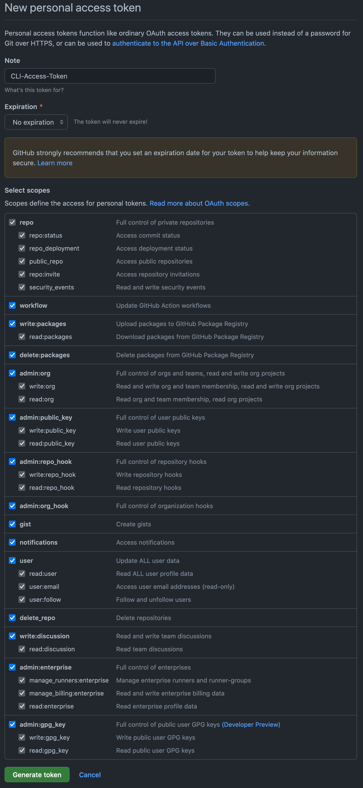

# Unit 1  OSX installfest

---

We will be installing and configuring the following tools to set up your development and classroom enviroments:

* Homebrew - A command line package/installation manager 
* zshell - a Unix login shell
* oh-my-zsh - a framework for managing zshell's configuration 
* GIT - everyone's favorite content management system
* Vscode - a lightweight and flexible code editor designed for web development (and more)
* If you are using an M1 chip mac, you will have to configure [Rosetta 2](https://www.computerworld.com/article/3597949/everything-you-need-to-know-about-rosetta-2-on-apple-silicon-macs.html) for compatibility with apps built for intel chips 

## Slack

We will be using slack to communicate throughout the course. You should've received an invite to our channels via e-mail. You can login via the web browser, but downloading / installing the app is highly recommended.

[Download Slack](https://slack.com/downloads)

## M1 Macs Only - Rosetta 2 

[If you need to install Rosetta 2](https://osxdaily.com/2020/12/04/how-install-rosetta-2-apple-silicon-mac/) you can use the following command:

```bash
/usr/sbin/softwareupdate --install-rosetta --agree-to-license
```

The following methods have had the most success for M1 compatibility:

* first try [this method](https://www.notion.so/Run-x86-Apps-including-homebrew-in-the-Terminal-on-Apple-Silicon-8350b43d97de4ce690f283277e958602) which creates a duplicate terminal that runs with Rosetta 2 for compatibility. You should use your Rosetta 2 for most brew installs.
* If that doesn't work try [this](https://soffes.blog/homebrew-on-apple-silicon), which will allow you to install a compatibility mode version of homebrew.  

## Homebrew

Homebrew is a command line interface package manager that we will use to install various development tools in our class.

Open up your terminal app and paste the following command into it to install homebrew:

```text
/bin/bash -c "$(curl -fsSL https://raw.githubusercontent.com/Homebrew/install/HEAD/install.sh)"
```
If you need to, you can visit the [homebrew website](https://brew.sh/) for more details.

You may be prompted to install XCode command line tools. When prompted, click yes and your homebrew installation will continue.

After the installation process, run the command `brew doctor`. If any warnings or errors are displayed, we will need to resolve them before proceeding with the rest of the install fest.

## Xcode (if prompted)

We do not use Xcode in class but some other applications that we do use require some Xcode libraries. Normally, all you need is the Xcode CLI which should have already been installed when you installed Homebrew. If it didn't get installed, you can use this command:

```bash
xcode-select --install
```

If you need to, you can install Xcode through the App Store. [Link here](https://itunes.apple.com/us/app/xcode/id497799835?mt=12)

## zsh

A shell is a text interface into our computer, and we will be using a lot to run commands.

Zshell is the default mac shell these days, but if you don't have it (or aren't sure) you can install it with the command:

```bash
brew install zsh
```

Don't worry, if homebrew noticed you already have it installed running this command won't cause any problems.

If it prompts you to change your default shell to zsh, select yes! When it asks you for your password, enter your computer user password \(it wont show up, but iTerm is keeping track of your keystrokes\).

If you are not asked about changing your shell, and you still have a `$` at the beginning of your prompt(meaning your shell is still bash), run the following command and then enter your password: 

```bash
chsh -s /bin/zsh
```

You can check to see if it worked with this command:

```bash
echo $SHELL
```

## oh-my-zsh

Oh my ZSH?!!! We will be tricking out commandline even further with [Oh-My-Zsh](https://github.com/robbyrussell/oh-my-zsh). When it comes to the terminal oh-my-zsh is the real life of the party. It is used to easily configure the look and feel of your command line.

Copy and past the following command into your terminal to install oh-my-zsh:

```bash
sh -c "$(curl -fsSL https://raw.githubusercontent.com/ohmyzsh/ohmyzsh/master/tools/install.sh)"
```

Restart your terminal, and you should see a brand new and colorful command prompt.

## GIT

Before we do this process, please make sure you have signed up for an account on [Github](http://www.github.com). We will be installing a version of GIT from home brew and also configuring it.

We will be installing a version of git from homebrew.

```bash
brew install git
```

after git is installed run the following command to check your git version:

```bash
git --version
```

**NOTE:** if you installed git with homebrew and are still seeing a version of git that is less than 2.28 run the following command to get the newest version of git. 

```bash
brew link --overwrite git
```

If it is anything less than 2.30.0, run the following command to get the latest version:

```bash
brew upgrade git
```

**Configuring GIT**

Using your email credentials for GIT, run these commands with your user and email configured.

```bash
git config --global user.name "YOUR-USERNAME"
git config --global user.email "YOUR-EMAIL-ADDRESS"
git config --global push.default simple
git config --global credential.helper cache
# optional: set the default git editor to be vscode to aviod getting stuck in vim
git config --global core.editor 'code -w'
```

**Setting up Github Personal Access Token**

We are going to to use need to generate a personal access token on github that will allow us to interact with github using the CLI more easily. 

The official github instructions can be found here [directions found here](https://docs.github.com/en/authentication/keeping-your-account-and-data-secure/creating-a-personal-access-token) to create a person access token.

Once you have your personal access token, the next time git asked you for your password in your terminal, you can use the token instead to configure git.

First, make sure your [gihtub email](https://github.com/settings/emails) has been verified.

Once your email has been verified, navigate to the [New Person Access Token page](https://github.com/settings/tokens/new) and do the following.

1. Give the Personal Access Token a memorable name that describes its function, such as **CLI-Access-Token**
1. Click on the expiration drop-down menu and set it to **No Expiration**
1. Scroll down and click every single scope checkbox
1. Check that your personal access token looks like this:



Now, click **Generate Personal Access Token** And you will be take to a page that displays a hash that starts with **ghp_**. Click the button to copy the hash, and save it someplace safe (such as slacking it to yourself), because github will never show you the hash again, and you will need to generate a new token if you lose it.

Next time you to to push to github, supply this hash as your password to authenticate your computer's terminal.

<!-- 
**Setting up SSH Key (if prompted)** 

You might find your self having to re-authenticate GIT every time you work on your command line. Setup SSH Keys to let Github remember your machine in the future.

* [Github Generating SSH Keys](https://help.github.com/articles/generating-ssh-keys/) 
* -->

### Install VS Code

Currently the most popular editor according to developer polls. This is Microsoft's free version of Visual Studio.

Run the following command to install vscode with homebrew:

```bash
brew install --cask visual-studio-code
```

vscode will appear in your applications folder when the installation is completed 

You can also download and install VS Code from [here](https://code.visualstudio.com/download)

**Adding the code Command to your Terminal**

First lets configure vscode. For ease of use, let's make it so we can automatically open up any file or project in VS Code, from our command line. The following instructions are taken from [these docs](https://code.visualstudio.com/docs/setup/mac). If you're on a windows or linux, see the left-side menu to switch to the instructions for your machine.

First open Vscode and then open the Command Palette with `Shift+⌘+P`. Type type 'shell command' to find the `Shell Command: Install 'code' command in PATH` command (it will be the first one that comes up).

Alternatively, you can achieve this functionality by adding VS Code to your path inside your ~/.zshrc file (zshell config file):

*NOTE: you don't need to do both*

Open your zshell config file with the following command:
```text
open ~/.zshrc
```
add this to the file path and save:

```bash
export PATH=$PATH:"/Applications/Visual Studio Code.app/Contents/Resources/app/bin"
```

Restart the terminal for the new $PATH value to take effect. You'll be able to type `code .` in any folder to start editing files in that folder. You can also open specific files with `code [filenname]`

#### OPTIONAL: Adding a Useful Color Theme with oh-my-zsh

Now we will use oh-my-zsh to add a useful color theme to our prompt. Use the command `code ~/.zshrc` to open your zsh config file in vscode. It lives in your root folder `~/` and is hidden, hence the `.` before the file name. 

Add the following line in the theme section (near the top) to set the oh-my-zsh theme to a handy one called 'af-magic'. af-magic will conveniently display your git information and working directory in your shell which is very helpful. It also display virtualenv information which will be helpful when we get into python in unit 4.

```bash
ZSH_THEME="af-magic"
```

You can of course experiment with different themes or even make your own! There are instructions in the .zshrc file to have a different theme shown in your console every-time your start it up to explore the different flavors. 

Save your .zshrc file and restart the terminal to enjoy!

---