# Windows 10 OS

## SEI Seattle Windows Install Fest

## Unit 1 

For the first portion of the class, we'll be working exclusively inside of the browser. We'll be installing the following tools.
Slack
Git
VS Code
Enabling Microsoft Developer
Ububtu 
Node.js
Postgres

### Slack

We will be using slack to communicate throughout the course. You should've received an invite to our channels via e-mail. You can login via the web browser, but downloading / installing the app is highly recommended.

[Download Slack](https://slack.com/downloads/windows)

### Configuring GIT

Using your email credentials for GIT, run these commands with your user and email configured.

    git config --global user.name "YOUR-USERNAME"
    git config --global user.email "YOUR-EMAIL-ADDRESS"
    git config --global push.default simple
    git config --global credential.helper cache

Setting up SSH Key

You might find your self having to re-authenticate GIT every time you work on your command line. Setup SSH Keys to let Github remember your machine in the future.

* [Github Generating SSH Keys](https://docs.github.com/en/free-pro-team@latest/github/authenticating-to-github/connecting-to-github-with-ssh)

### Install VS Code

Currently the most popular editor according to developer polls. This is Microsoft's free version of Visual Studio.

Download and install VS Code from here

You're all good to go now, but for ease of use, let's make it so we cna automatically open up any file or project in VS Code, from our command line. The following instructions are taken from these docs. If you're on a Windows or linux, see the left-side menu to switch to the instructions for your machine.

To be able to open VS Code from any directory, open the Command Palette (Shift+⌘+P) and type 'shell command' to find the Shell Command: Install 'code' command in PATH command (it will be the first one that comes up).

Restart the terminal for the new $PATH value to take effect. You'll be able to type 'code .' in any folder to start editing files in that folder.

### Enable Windows Developer Mode
Begin by going into the developer setting.

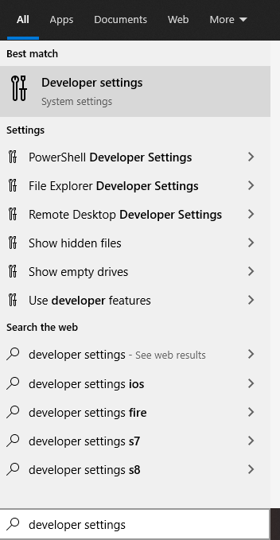

#### Once inside turn developer setting on as well as Powershell

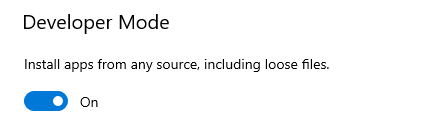
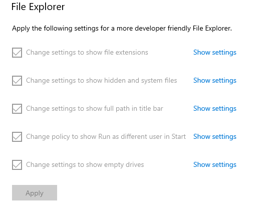
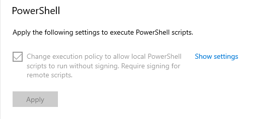

### Enable Subsystem for Linux

Press the windows key + R to open the run controller.

Type `optionalfeatures.exe` in the popup.


This new window you will need to scroll down to the `Windows Subsystem for Linux`

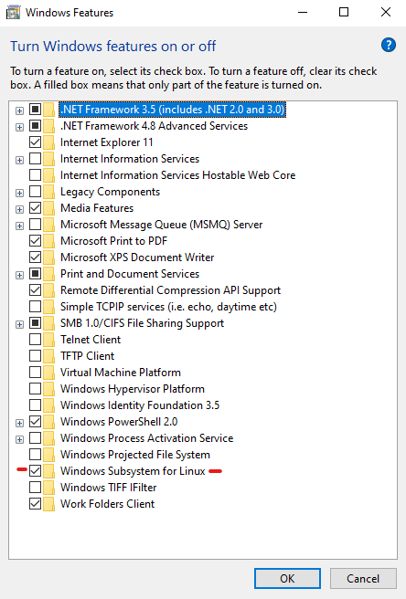

Press ok and PUSH and update for Windows.
*Windows might not ask you to update at the time, however you need to check for an update.

 **Restart your windows machine**

**Once your machine has restarted**

Open the windows App store and search for seach and install Ubuntu.


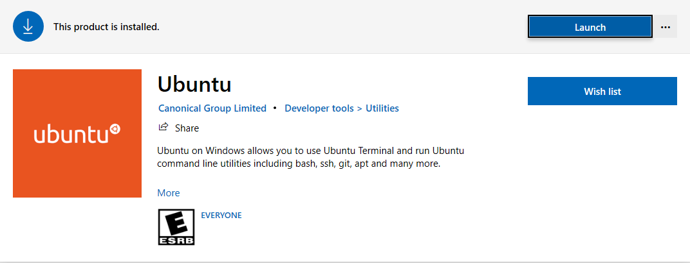


After this has been installed open and run the ubuntu terminal install

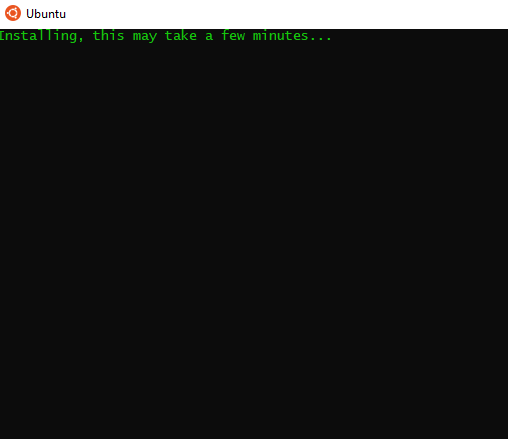


**You do _NOT_ need to make an account once it has been installed**

Close Ubuntu. This will be the last time we use Ububtu.

### Adding `Touch` to the Powershell commands
Copy and paste this code chunk into the Powershell terminal.

    function touch {New-Item -ItemType File -Name ($args[0])}

###  Node

To install Node

* [Node.js](https://nodejs.org/en/)
Select the LTS version, this is recommended for most users.

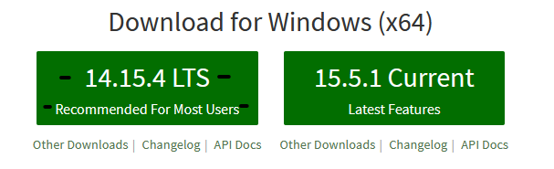

## Unit 2

### Postgres

Goto the [Postgress website](https://www.postgresql.org/download/) and download the Windows installer.

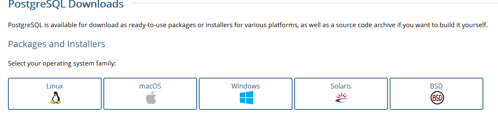


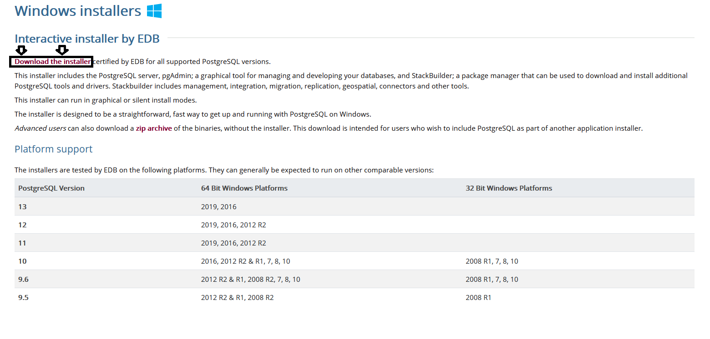


Download the most recent version **_Remember the version_**

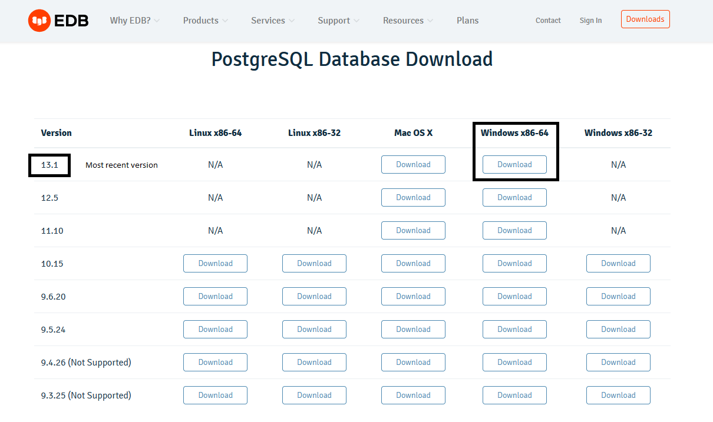

GO through the installation.

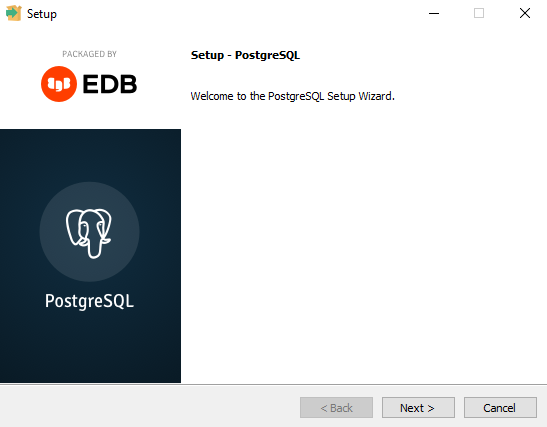


**Make a password you can remember**

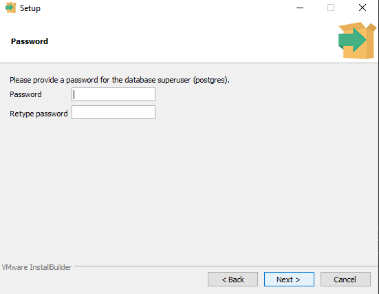


### _Do not change port_
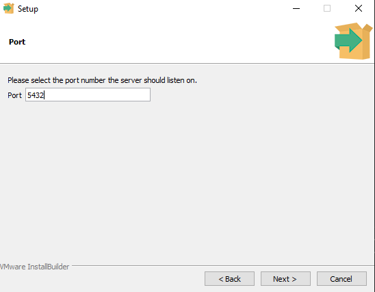


To get Postgres to work you will need to change a path in the `System variables`

Go into file explorer and right click on `My PC/This PC` and then select _properties_


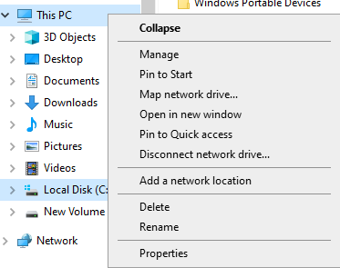


find *Advanced system settings*


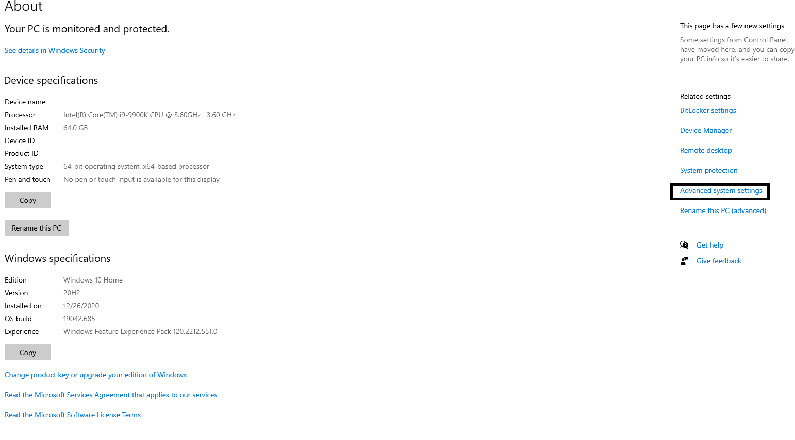


Click on _Environment Variables_


Locate **_System Variables_**, Scroll to **_Path_**, and Click **_Edit_**.

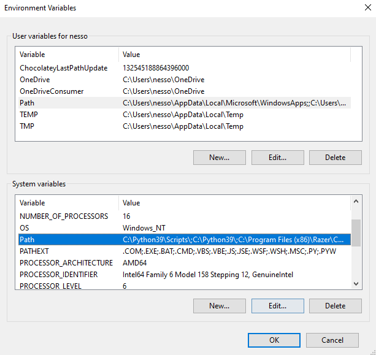


Click New 

    C:\Program Files\PostgreSQL\13\bin

**If your version is later than this 14, 15 etc replace 13 in the file path. You do not need to add .1, .2 etc only use main version.**

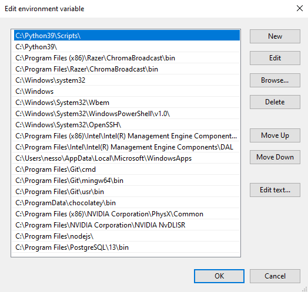


Test this by going into powershell and login into your PSQL account.

Your username is **_not_** your PCs username.
The username for PSQL shells is:

    psql -U postgres

Type in your password that you set during the installation.

Your Powershell should look like similar to this.


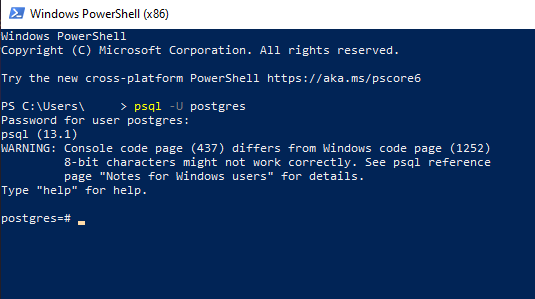

## Sequlize Step 1 - Adding the Sequelize-cli tool. This will only be needed to done once.

This is a command line code to set up the command line package to make psql a faster expirience. No more going into your psql shell manually

    npm install -g sequelize-cli pg sequelize 

### For future knowledge -g means this is a global instalation
Thus enabeling you to not have to install these every time you make a new repository

## Step 2 - starting a new node project

Let's build our first app using Sequelize! First we need to create a node app and include our dependencies. All in terminal:

Create a new folder and add an `index.js` and .`gitignore` and initialize the repository

    mkdir userapp
    cd userapp
    npm init -y
    touch index.js
    echo "node_modules" >> .gitignore


#### Initialize your new project

    sequelize init


## Now that you have a config.json

enter your `config.json` and then its time to edit!

    {
    "development": {
        "username": "postgres", <- **You change TO this**
        "password": "**password you set**", <- **You change this**
        "database": "name of database you want to create/use", <- **You change this**
        "host": "127.0.0.1",
        "dialect": "postgres" <- **You change TO this**
    }
    }
    You can delete the rest of the file.


## Create a database inside of Postgres
The sequelize CLI has a command called `createdb`. This performs the same action as entering our psql shell and entering `CREATE DATABASE`.

    sequelize db:create

Thats it (but dont you need to put the name of the data base?) **_Nope!!_** this command takes all of the data from the config.json and submits it!
all commands from here on out will use `sequelize` as the starting command!!!

# Unit 3

You will need to follow the directions [here](https://github.com/SEI-SEA-1-25/python-installfest#windows-chocolatey-install) to install mongo db.

# Unit 4

## Windows (Chocolatey install)

We are going to be using [chocolatey](https://chocolatey.org/) to install python. Chocolatey is a deliciously named package installation manager for windows powershell that is similar to homebrew for unix based operating systems. Chocolatey commands all start with the command prefix `choco`. You always need to be in a powershell with admin privileges to run chocolatey commands.

___

Our todolist:

1. install the chocolatey package manager
1. use chocolatey to install python3

#### Install Chocolatey

This is adapted from the [chocolatey install instructions.](https://docs.chocolatey.org/en-us/choco/setup)

First, open a powershell with admin privileges. You can do this easily by right clicking the start menu and selecting `Windows Powershell Admin`:

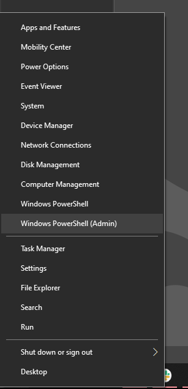

After your admin powershell is open copy and past the following script to install chocolatey.

**Make sure you carefully copy the whole command, because it is long**

*chocolatey will ask you some questions about granting permissions during the install. Say `yes` to to everything by typing a `y` and pressing return.*

```c#
@"%SystemRoot%\System32\WindowsPowerShell\v1.0\powershell.exe" -NoProfile -InputFormat None -ExecutionPolicy Bypass -Command "[System.Net.ServicePointManager]::SecurityProtocol = 3072; iex ((New-Object System.Net.WebClient).DownloadString('https://chocolatey.org/install.ps1'))" && SET "PATH=%PATH%;%ALLUSERSPROFILE%\chocolatey\bin"
```

After chocolatey installs, stay in the same admin powershell and use the following command to install python with chocolatey:

```c#
choco install python
```

*You will recieve many prompts about permsissions during the install. **SAY YES TO ALL OF THEM**. You can type `a` and press return on any prompt to say `yes to all`*


after python installs, check the installation with the following commands:

```bash
# should return python 3.X.X
python --version
```


```bash
# should return pip X.X.X
pip --version
```

You can also open up a `git bash` terminal and check the commands to make sure everything is connected.