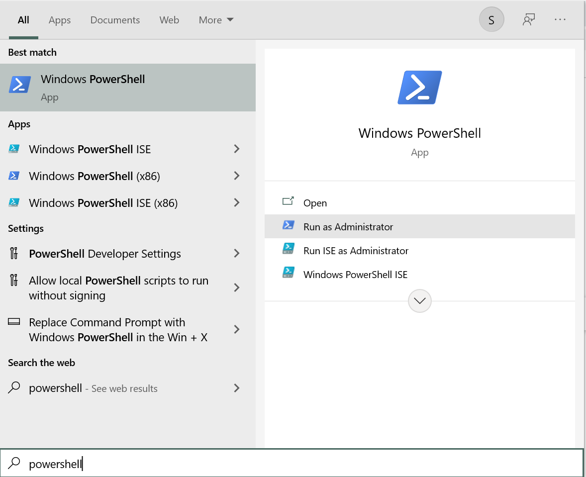
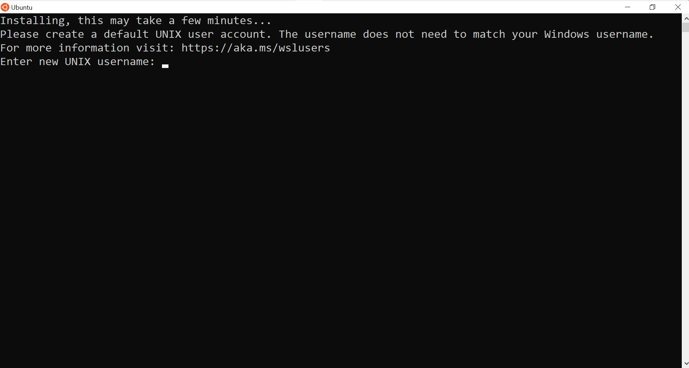
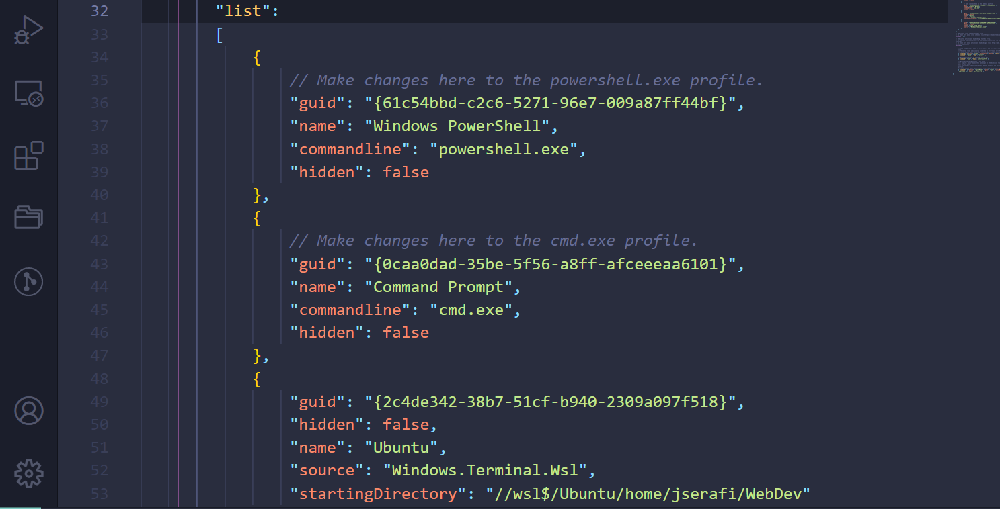
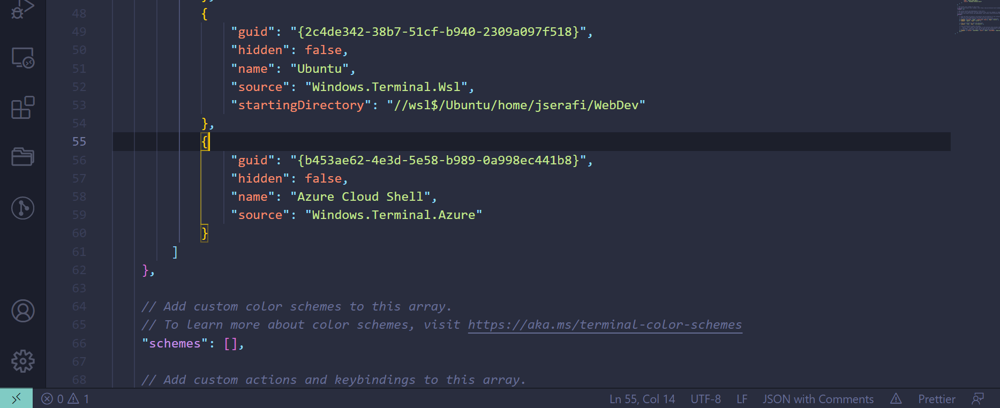
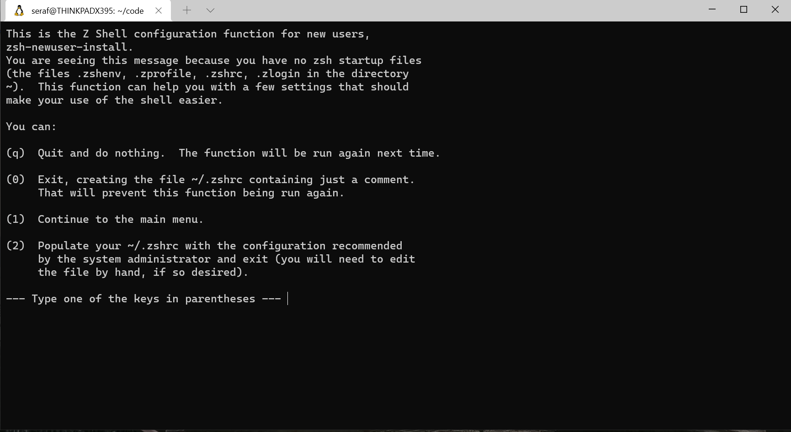

# Installfest for Windows, Step 1: Unix Terminal on Windows

Follow [Microsoft's instructions](https://docs.microsoft.com/en-us/windows/wsl/install-win10#manual-installation-steps) to get Windows Subsystem Linux 2 installed on your system. You may have to restart your computer several times or change your computer's BIOS options. Again, this documentation is provided as-is, and you are responsible for any changes following this guide may have on your machine. These steps are briefly summarized below starting with Step 1.

You may have to enable virtualization from your computer's BIOS menu. Refer to your computer's manuals/manufacturer's instructions for additional details.

1. First, open the PowerShell Command Line app on your computer. Run it with admin privileges.



Run the command:
```
wsl --install -d Ubuntu
```

This will install the Ubuntu Linux system to your computer. We will continue setting it up in the rest of this guide.


3. Install [Windows Terminal](https://www.microsoft.com/en-us/p/windows-terminal/9n0dx20hk701?activetab=pivot:overviewtab) from the Microsoft App Store.

4. Install [VSCode](https://code.visualstudio.com/). This will be your main text editor. Make sure to select the options to associate file types with VSCode and to set up PATH when you insall it.

## Configuring your default user for Ubuntu

When you first download Ubuntu, the computer will ask you to set up a default username. Usernames cannot have any spaces. 



Next, the computer will ask you to set a password for your Linux user. It will not show any letters or numbers you are typing, but the computer is listening! When you have entered a password and confirmed it, be sure to write it down somewhere safe! There is no way of recovering this password otherwise!

## Setting Windows Terminal to Use Ubuntu by default

While you downloaded an Ubuntu command line from the Microsoft Store, we recommend using Windows Terminal as your main command line, as it is easier to adjust some settings.

Open up Windows Terminal and click on the the downward facing arrow next to the new tab (+) button. Click on the settings button.


look for a field called `defaultProfile: ...` in the settings.json file. make note of where it is located. it will be overwritten soon.


next, scroll down until you find a field called `"profiles": ...` and look for `"list":...` nested inside



find this property: `guid: "{...}"` of `name: ubuntu` inside the list of profiles. 

now, copy the value for `guid:` (the stuff after guid in quote and curly braces like this: `"{THE LONG CODE FOR THE UBUNTU PROFILE}"` ) into `defaultProfile:...`. It will look similar to the screenshot below. Notice the startingDirectory field. If you have a fresh install, that will not be there. 



Inside the `guid: {UBUNTU GUID}`, add a new property beneath `name: ubuntu`. This will be the default folder that opens when you launch your terminal.

`"startingDirectory": "/home/ YOUR USERNAME HERE `

Lastly, take the UBUNTU GUID and paste it into `defaultProfile` field.

Save the settings.json file and return to Windows terminal.

## Configuring Default Packages And Software for Ubuntu

1. Type `pwd` at the command line. If it gives a path similar to `/home/yourname`, then you're in great shape! If it says that is not a recognized command, try running `bash` or `zsh` first and then `pwd`. 

2. If you do not have Zsh installed, I recommend installing Zsh with the following command:

`sudo apt-get update && sudo apt-get -y install zsh`

Make Zsh your default terminal by running:

`chsh -s /bin/zsh`

Zsh will ask you to set up a default profile when you run it for the first time. Select 0 in the menu to generate this profile automatically. 



If the terminal cursor switches to a %, then you are succesfully using Zsh. If you are not seeing the % as your terminal cursor, you can run the command `zsh` to switch to it.

3. Install [oh-my-zsh](https://ohmyz.sh/) to have a beautiful, easy to use Zsh terminal!

4. Run `sudo apt-get update` to ensure your Linux installation is up to date.

5. Run
```
sudo apt-get -f install
```
to ensure all default packages are installed.

Excellent- you now have Linux installed on your computer, which will let you use the nearly same commands as everyone else using a Unix system!

For example, when someone with a Mac says "command" or "apple" key, press control instead. Other keyboard commands may be different, and we've highlighted a few for you to memorize.

6. Signing your code with Git

You can install Git- our Version Control System for our code with these commands:

```
sudo add-apt-repository ppa:git-core/ppa
sudo apt update
sudo apt install git
```

Next, run this command to set your default git branch name:

```
git config --global init.defaultBranch <name>
```

Now, you'll have to tell Git who you are. This will identify you as the rightful author and owner of any code you write and publish.

Run: `git config --global user.email "YOUR EMAIL ADDRESS HERE` 

Then: `git config --global user.name "YOUR NAME HERE"`

More detailed configuration will be in the next section: Next, we will continue configuring git!

[Your next step will be configuring git!](git-configuration.md)

* [x] Command Line
* [ ] [Configuring Git](git-configuration.md)
* [ ] [Databases, Languages, and Frameworks](dbs-languages-frameworks.md)
* [ ] [Desktop Applications](desktop-applications.md)
