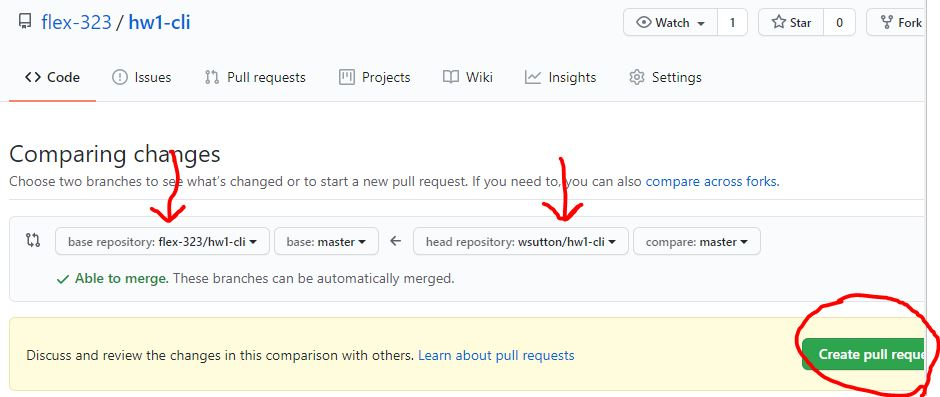

# How to Submit a Deliverable

# 

## Homework Submission Instructions

1. Go to the assignment repository.

### Fork and Clone that repository.

1. Click Fork in the upper right hand of the repo


Now you should see the repo is under your personal account


2. Clone down the repo in terminal in your hoemwork folder using a command simliar to this:

```git clone https://git.generalassemb.ly/wsutton/hw1-cli/```

One exception: Obviously, you are not wsutton, so in that part of the command you'll put your own username.

### Follow insturctions for assignmnet

3. Complete the work, add files, etc.

### Perform three important git steps

Go back to the root of your repository, so that you are the folder `hw1-cli`:

"Add" your changes (prepare them to be "committed"):
```
$ git add -A
```

"Commit" your changes—any time you make a commit, you can always restore the files in the repo to that point:
```bash
$ git commit -m "Completed homework assignment"
```

"Push" your commits to github:
```bash
$ git push origin master
```


### Creating the Pull Request

6. Now navigate to your forked repository.

7. Once there, click on the `Pull Requests` button.


8. At the top you see the two dropdowns that allow you to pick what repo you want to use to make a pull request as well as which repo to make that request to.
You need to click on `compare across forks` to show your forked copy.

9. Switch to the appropriate repos. (On the left, the original repo. On the right, your forked branch).


10. Now click "Create Pull Request"

11. In the 'title' field simply write your name.

12. In the description area, fill this out to let us know how it went for you:
```
Comfort score: (1-5)
Completeness score: (1-5)

Questions? Comments? Add them here:

```


13. Then hit `Create pull requests` and you are done!


### Oh no! I cloned down the repository before forking it!! 😱

No worries! This happens all the time, and if you try to push to one of our organization's repositories, you'll probably get a message that says something along the lines of "Fatal: Access to `url` denied." If you need to change the remote repository associated with your local git repository, just use the following steps: 

1. Fork the repo to your own account and copy the SSH URL. It should have your username instead of flex-323 in the URL. 
2. Copy out any the files you created to your desktop.
3. On your computer, delete the original repository.
4. Now clone down the repo that you forked.
5. Copy the files from you desktop into the new repo on your computer, then add commit and push and complete the pull request steps.

