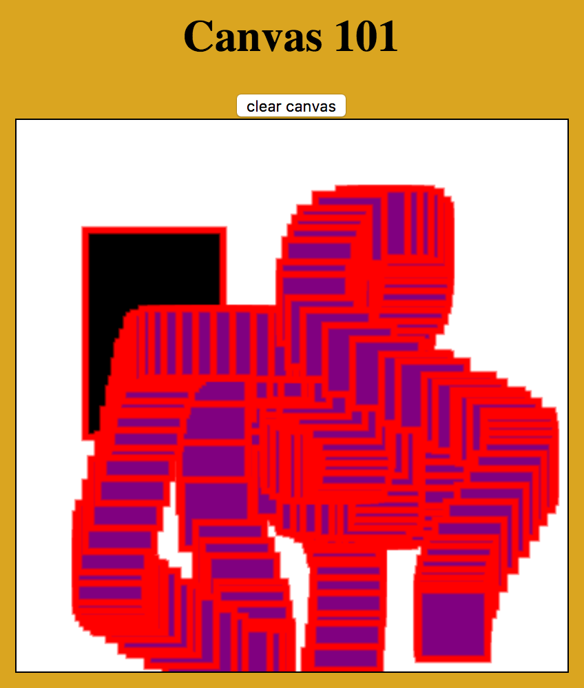

#HTML5 Canvas
HTML5, released October 28th 2014, is the latest version of HTML. It builds
on top of many years of specifications and development done since when HTML
was first released by Tim Berners-Lee in 1993.

This site shows off what tags were included in each version of HTML from
version 1 to version 5:

<http://www.martinrinehart.com/frontend-engineering/engineers/html/html-tag-history.html>

* **HTML 1 (1993)**
  * `<a>`, `<h1>` - `<h6>`, `<ul>`, `<li>`, `<p>`, `<title>`
* **HTML 2 (Nov 24 1995)**
  * `<!DOCTYPE>`, `<html>`, `<head>`, `<body>`, `<meta>`, `<link>`
  * `<table>`, `<thead>`, `<tbody>`, `<tfoot>`, `<tr>`, `<td>`
  * `<form>`, `<input>`, `<select>`, `<option>`, `<textarea>`
  * `<em>`, `<strike>`, `<strong>`, `<u>`, `<i>`,
  * ``
* **HTML 3 (Jan 14 1997)**
  * `<div>`, `<center>`, `<font>`
  * `<script>`, `<style>`
* **HTML 4 (Dec 18 1997)**
  * `<button>`, `<label>`, `<span>`
  * `<iframe>`
* **HTML 5 (Oct 28 2014)**
  * `<audio>`, `<video>`, `<canvas>`
  * `<header>`, `<footer>`, `<nav>`, `<section>`
  * `<summary>`, `<time>`, `<progress>`
  * `<output>`

It looks like HTML 1 was all about creating pages with basic text. HTML 2
introducted the HTML / HEAD / BODY structure of web pages we know today,
and it gave us images, forms, inputs and tables. HTML 3 added divs, fonts
and, most importantly, CSS and JavaScript as we know it. HTML 4 offered
buttons, labels for inputs and iframes (which I feel are rarely used much
anymore today). Finally, HTML 5 came out with some new semantic improvements
by giving developers the header, footer, nav, section and summary tags. Those
elements don't do much to make things look different on the page but they're
useful for developers to be able to add meaning to their web pages.

Perhaps the most exciting features of HTML 5 are the addition of the `<audio>`,
`<video>` and `<canvas>` tags. In the past, users relied on technologies like
Flash in order to create rich interactive multimedia content on the web. The
introduction of these new multimedia tags allowed developers and netizens to
have native in-browser support for `<audio>` `<video>` experiences for the
first time! Woo!

## The Canvas Tag
The `audio` and `video` tags are alright. They allow a page to play audio
and movies. What's really cool is the `<canvas>` tag. The `<canvas>` tag
is basically a block element that the browser can programatically draw on.
Think of it like a `<div>` where you can use JavaScript to execute Microsoft
Paint commands on. The canvas element provides an API to JavaScript where it
can do things like draw lines, draw curvers, fill in shapes, and draw images
to the canvas.

Note: the canvas element has limitations. The biggest limitation is that the
canvas element is only showing an image at the end of the day. Although it
will allow you to draw cool, unique things on the page the canvas is not good
for creating text that users want to highlight, or displaying links people
can click on. So: canvas is great at displaying things, but keep in mind that
if you ever draw text to the canvas the text won't act like text on a website
that can be highlighted and copied and pasted. The text will act like text
that's inside of an image.

## Drawing on the Canvas
Check out this repo to bare-bones page with a canvas we can draw on.

The canvas element provides us with something called it's **context**. Think
of context like a repo for canvas methods. Canvas supports a variety of 
different contexts, primarily 2D and 3D. We'll be using our canvas for drawing 
simple two-dimensional images so we'll grab the 2D context off the canvas.

The canvas element is the canvas we paint on, the context is like our
paintbrush. We'll use the context to paint rectangles at first. The context
provides us with two ways to draw a rectangle. We can **stroke** or **fill**
a rectangle. Stroke a rectangle produces an outline of a rectangle with a hollow
see-through center. Filling a rectangle draws a solid rectangle. We can "dip"
the context paintbrush into two seperate colors for the stroke and fill.

Let's fill a black rectangle and stroke it's border with a 5px red line.

```html
<body>
  <h1>Canvas 101</h1>
  <canvas id="easel"></canvas>
</body>
```

```js
document.addEventListener("DOMContentLoaded", main);

function main() {
  // Get a reference to the canvas and grab something called the "context" off
  // it.  The context defines how we interact with the canvas. We're not doing
  // 3D so we grab 2D.
  var canvas = document.getElementById("easel");
  var ctx = canvas.getContext("2d");

  // The canvas doesn't register the same way as a div, so if you set the width
  // and height properties in your CSS file, you'll end up stretching the canvas
  // which automatically has 2:1 ratio (width of 300px and a height of 150px). 
  // You can get around this by putting the width and height in the HTML or doing
  // it programatically by assigning attributes with Javascript
  canvas.setAttribute('width', '800');
  canvas.setAttribute('height', '800');
  
  // It turns out to be useful to attach the width and height properties to the
  // ctx too, so it knows how big it's canvas is. 
  ctx.width = canvas.width;
  ctx.height = canvas.height;

  // Define some variables for the x,y coordinates of where we'll draw
  // and the width and height of rectangles we'll draw.
  var xx = 50;
  var yy = 80;
  var width = 100;
  var height = 150;

  // The ctx is like our paintbrush. Let's set the width of a line we'll draw
  // and choose different colors for fill (the inside of shapes) and for it's
  // stroke (a line on the border of shapes).
  ctx.fillStyle = 'black';
  ctx.strokeStyle = 'red';
  ctx.lineWidth = 5;
  
  // fill an entire rectangle
  // then stroke around it's edges with red.
  ctx.fillRect(xx, yy, width, height);
  ctx.strokeRect(xx, yy, width, height);
}
```

## Attach Mouse Interactions
Cool. That's some simple canvas work right there! Let's make things more
interesting by making the canvas draw a rectangle wherever someone clicks.

Although the canvas element provides us the unique ability to draw things
on a web page it still behaves like all other HTML elements. We can style
the width, height, position and border of it. We can also attach click handlers
to it.

Let's write a function that accepts an x and y parameter and draws a small
rectangle at that location. Then, let's attach a click handler so whenever
someone clicks on the canvas element we extract the x and y coordinates from
the click event and pass the coordinates to the draw rectangle function.

Oh, the function will need access to the `ctx` variable too. We'll pass that
as a parameter too.

The click event object has lots of different x and y coordinate information:

* **clientY** - y distance from the top left corner of the webpage, under the
  bookmarks and URL location bar. Ignores scrolling. If the user scrolls down
  1,000 pixels and clicks on the page just under their bookmarks bar the y
  value will stay close to zero.
* **layerY** - y distance from the mouse to the closest positioned element.
* **offsetY** - y distance from the top left corner of the element that was
  clicked on.
* **pageY** - y distance from the top left corner of the page, including any
  scrolling. If a user scrolls down 1,000 pixels and clicks on the page just
  under their bookmarks bar the y-value will be close to 1,000.
* **screenY** - y distance from the top left corner of the entire laptop screen,
  like (0,0) would be near the top-left Apple icon on a Mac.
* **y** - an quick-shortcut alias for the `clientY` property.

Let's use the `offsetX` and `offsetY` properties off the event object.

```js
function drawRectangle(x, y) {
  // these rectangles will be 50x50px squares
  var size = 50;
  
  ctx.fillStyle = 'purple';
  ctx.stokeStyle = 'yellow';
  ctx.lineWidth = 5;
  
  ctx.fillRect(x, y, size, size);
  ctx.strokeRect(x, y, size, size);
}
```

```js
canvas.addEventListener("click", function(event) {
  drawRectangle(ctx, event.offsetX, event.offsetY);
});
```

Notice that ever new rectangle is drawn on top of everything else. It's just
like painting over it.

## Erase Entire Canvas
There gets to be a lot of rectangles on the canvas after the user clicks a
bunch. Let's add a button that will let us erase everything on the canvas.
The `ctx` object provides a `.clearRect(x, y, width, height)` function that
allows us to erase everything on the canvas within a specified rectangular
region.

```html
<body>
  <h1>Canvas 101</h1>
  <div>
    <button id="clear">clear canvas</button>
  </div>
  <canvas id="easel"></canvas>
</body>
```

```js
document.getElementById("clear").addEventListener("click", function() {
  clearCanvas(ctx);
});

function clearCanvas(ctx) {
  ctx.clearRect(0, 0, ctx.width, ctx.height);
}
```

## Graphics Loop
OK, it's cool that there's a rectangle on the page when it loads, and it's cool
that we can make more rectangles when someone clicks on the page. Let's make
the page even better by having a rectangle float under the user's cursor as they
move their cursor around the campus.

This is as easy as attaching another event handler to the canvas. We used a
click listener before. Let's make a new one that listens for mouse movement
and hook it up to the same `drawRectangle` function.

```js
  canvas.addEventListener("mousemove", function(event) {
    drawRectangle(ctx, event.offsetX, event.offsetY);
  });
```



Hooking the canvas up to draw a rectangle every time the mouse moves ends up
drawing a lot of rectangles to the page! Remember that every time something
is painted to the canvas it just stays there. Everything gets painted over
everything else. Let's fix this up by erasing everything on the canvas each
time the mouse moves and then drawing our one new rectangle.

Every other rectangle gets deleted each time the mouse moves, but now there's
just one rectangle that hovers under the user's mouse. Now our canvas looks very
interactive and snappy! Very cool.

```js
  canvas.addEventListener("mousemove", function(event) {
    clearCanvas(ctx);
    drawRectangle(ctx, event.offsetX, event.offsetY);
  });
```

## Persist Previous Drawings
OK, it's cool that we're able to constantly draw a rectangle under the users's
mouse, but it's a total shame that the rectangles we click to draw are
immediately erased. Nothing persists. We only see the one rectangle under
the mouse.

We need to change the program so that instead of only drawing the current
rectangle when the mouse moves it should draw every rectangle that's ever been
added to the canvas.

Right now our program looks like this:

```
draw the first rectangle on the screen
draw a new rectangle whenever someone clicks
erase the entire canvas and draw a rectangle whenver the mouse moves.
```

The problem with our program is the fact that we're erasing everything. But,
we're at a catch-22. We need to erase everything so that we don't leave a trail
of squares behind wherever the mouse goes.

We'll need to change our program to keep track of everywhere someone has clicked
and we'll need to tell the program to draw all of the squares again each time
it erases the screen.

Basically, instead of drawing rectangles immediately we'll instead add the
coordinates of each rectangle to an array. Whenever we need to erase the screen
we can run a for loop over the array of rectangles and immediately redraw them.
We'll only add rectangles to the array that we want to stay forever. This means
we can still draw rectangles that follow the mouse when it moves, but those
mouse-move rectangles won't be added to the array and they won't be drawn in the
future.

Our program will look like this:

```
draw the first rectangle to the screen
add that rectangle's coordinates to an array to remember where it goes
add new rectangle coordinates to the array whenever someone clicks
erase the screen whenever the mouse moves
redraw all of the rectangles in the array
draw one rectangle where the mouse was
```

How should the rectangles be stored in the array? We could use strings to have
coordinates like `["0,0", "76,299"]` or we could store coordinates in small
arrays like `[[0,0], [76,299]]`. These options would get the job done, for sure,
but they lack semantics. There's no real meaning imposed on the data when we
store the data this way. Which coordinate is the `x` coordinate? Is the `y`
coordinate in the first position or the second position? It's hard to remember,
it's easy to make mistakes, and it's hard for whoever else comes to read our
code later. Let's make life better.

We could store all of the rectangles as objects with `x` and `y` values like
`[{x: 0, y: 0}, {x: 76, y: 299}]`. This is definitely better because the `x`
and `y` values have become unambigious. We can still do better!

Rectangles are things, right? Things are, like, objects, right? Let's use
object-oriented programming to create a class that models what a rectangle
is! A class is even better than just an object with `x` and `y` properties
because it has a name now too. We're clearly saying "these x and y coordinates
represent a Rectangle." Just the fact that the class has a name, "Rectangle",
makes our code even easier to understand.

Also, creating a class gives us a great place to attach more information in the
future. Now that we have a rectangle class it would be easy for us to add other
properties like size, color, outline line. All of this information all in one
place. Amazing.

Make a new file called **rectangle.js** that contains the class definition
for our rectangles and remember to attach a `<script>` reference to the new
file in **index.html.**

```js
class Rectangle() {
  constructor(x, y) {
    this.x = x;  
    this.y = y;
  }
}
```

Use the Rectangle class to create rectangles and save them to an array. Make
a new function called `redraw()` that accepts `ctx` and an array as parameters
and redraws all of the rectangles. Call the new `redraw()` function just after
you erase the canvas when the mouse moves, and before you draw the new rectangle
that hovers under the mouse.

Careful! Notice that pressing the "clear canvas" button now erases the canvas
for a moment, but all of the rectangles come back as soon as the mouse moves.
This is because although the canvas was cleared of everything that was painted
on it, the array still maintains memory of all the rectangles it's supposed to
be drawing. We must update our "clear canvas" click handler so it resets the
array of rectangles back to empty too.

```js
// introduce a new global variable
var RECTANGLES = [];

function addRectangle(x, y) {
  var rect = new Rectangle(x, y);
  RECTANGLES.push(rect);
}

function drawRectangles(ctx, rects) {
  rects.forEach(function(rect) {
    drawRectangle(ctx, rect.x, rect.y);
  });
}

canvas.addEventListener("click", function(event) {
  addRectangle(event.offsetX, event.offsetY);
  drawRectangle(ctx, event.offsetX, event.offsetY);
});

canvas.addEventListener("mousemove", function(event) {
  clearCanvas(ctx);
  drawRectangles(ctx, RECTANGLES);
  drawRectangle(ctx, event.offsetX, event.offsetY);
});

document.getElementById("clear").addEventListener("click", function(event) {
  clearCanvas(ctx);
  RECTANGLES = [];
});
```

## Refactor Draw Method Inside Rectangle Class
Object oriented programming allows us to:

1. model data that represents what objects are
2. define functionality that defines what objects can do

Create a new function called `draw` on the Rectangle class that accepts a `ctx`
as a parameter and has rectangles draw themselves onto the canvas with the
`ctx` according to their own `this.x`, `this.y` and `this.size` values.

After doing this we can delete the `drawRectangle` function in **main.js** and
simply iterate through rectangles and tell them to draw themselves. It's nice
to keep everything related to rectangles inside the one file inside the one
class.

The rectangle class provides a good pattern for us to follow if ever want to
add more shapes or figures to this website. We can define classes for squares,
create circles, triangles or anything else.

```js
RECTANGLES.forEach(function(rect) {
  rect.draw(ctx);
});
```

```js
class Rectangle {
  constructor(x, y, size) {
    // these rectangles default to being 50x50px squares
    this.size = size || 50;
    this.x = x;
    this.y = y;
  }
  
  draw(ctx) {
    // The ctx is like our paintbrush. Let's set the width of a line we'll draw
    // and choose different colors for fill (the inside of shapes) and for it's
    // stroke (a line on the border of shapes).
    ctx.fillStyle = 'purple';
    ctx.strokeStyle = 'black';
    ctx.lineWidth = 5;
    
    // fill an entire rectangle
    // then stroke around it's edges with red.
    ctx.fillRect(this.x, this.y, this.size, this.size);
    ctx.strokeRect(this.x, this.y, this.size, this.size);
  }
}
```
