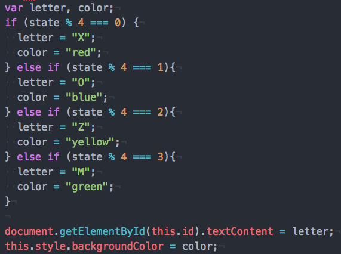
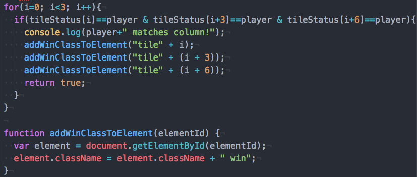

# How to Reduce Redundancy
Imagine someone telling you to pick up a few things at the grocery store:

"Go to the Safeway at 50th and Brooklyn in the U-District by the Jack in the Box
and pick us up a gallon of milk. Oh, also, while you're at the Safeway at 50th
and Brooklyn in the U-District by the Jack in the Box you should also buy a
12-pack of Mountain Dew. It's a fun errand. The cashier guy at that Safeway at
50th and Brooklyn in the U-District by the Jack in the Box is hilarious."

Wow. Why did they have to tell us exactly where it is so many times? We got the
idea the first time they clarified it. Although it's easy to see that telling
someone the exact location of a Safeway several times in conversation is
unnecessary in a conversation, it's easy to make the same sort of mistake in
programming.

## Learning Objectives
- define redundancy
- identify examples of redundancy
- see how to reduce redundancy
- practice reducing redundancy

## What is Redundany?
`Redundancy` is any code that repeats itself unnecessarily. Redundant code can
take a long time to write. Redundant code exposes programs to silly errors, like
increasing the likelihood of making a typo when you type something several times,
or making a change in 9/10 places, but forgetting to make a change in the last
tenth place.

Programmers like to reduce redundancy for several reasons:
- code becomes easier to read
- code becomes easier to maintain
- code may become more efficient because a computer doesn't have to
  process identical operations over and over again.
- it's easier to make changes to
- changes made in just one place are guaranteed to be consistently the same.
- sometimes programmers just like to write code because it's shorter and
  faster to write!

Here's a collection of several examples of redundant code and what you can
do to prevent redundancy.

### Flipping Boolean Values
It's super common to flip a boolean value back and forth between true and false.
Instead of using a four-line if/else structure, you can use the `not` operator
to turn `true` into `false` and `false` into `true`. Here's your options:

```js
if (booleanValue === true) {
  booleanValue = false;
} else {
  booleanValue = true;
}
```

```js
booleanValue = !booleanValue;
```

### Iterating Through Numbers
Here we're trying to write code that steps us through the strings
cell0, cell1, cell2 ... up to cell8. We don't need to write this all out
manually.

It's possible to use a for loop to step through the sequence of numbers we need,
and we can use string concatenation to build up the string we need.

```js
document.getElementById("cell0").textContent="";
document.getElementById("cell0").style.backgroundColor= "white";
document.getElementById("cell1").textContent="";
document.getElementById("cell1").style.backgroundColor= "white";
document.getElementById("cell2").textContent="";
document.getElementById("cell2").style.backgroundColor= "white";
document.getElementById("cell3").textContent="";
document.getElementById("cell3").style.backgroundColor= "white";
document.getElementById("cell4").textContent="";
document.getElementById("cell4").style.backgroundColor= "white";
document.getElementById("cell5").textContent="";
document.getElementById("cell5").style.backgroundColor= "white";
document.getElementById("cell6").textContent="";
document.getElementById("cell6").style.backgroundColor= "white";
document.getElementById("cell7").textContent="";
document.getElementById("cell7").style.backgroundColor= "white";
document.getElementById("cell8").textContent="";
document.getElementById("cell8").style.backgroundColor= "white";
```

```js
for (var i = 0; i < 9; i++) {
  document.getElementById("cell" + i).textContent="";
  document.getElementById("cell" + i).style.backgroundColor= "white";
}
```

### Factoring if/else Branches

Whenever a piece of code appears in every branch of an if/else if/else
statement we can factor it out so it appears just once immediately
after the entire if statement.

Think of this like reducing a common denominator from a fraction. If every branch
of an if/else statement is "divisible" by a statement then the statement can be
"factored out" and written just just before or after the entire if/else statement.

```
6/8 = (2 * 3)/(2 * 4) = 3/4
```

```js
if (whosTurn == "X"){
    whosTurn = "O";
    displayX(this);
} else {
    whosTurn = "X";
    displayO(this);
}
```

```js
if (whosTurn == "X"){
    whosTurn = "O";
} else {
    whosTurn = "X";
}
displayO(this);
```

### Encapsulating Redundancy With Functions

These two functions repeat code defining how to set a background image.
We can make a third function that accepts a parameter representing The
filename to be used as the background image, and each of the original
functions can pass in their filename to the old function.

```js
function displayX(thing) {
    thing.style.background = "url(img/cross.jpg) 0% 0% / cover";
}

function displayO(thing) {
    thing.style.background = "url(img/circle.png) 0% 0% / cover";
}
```

```js
function displayX(thing) {
    displayImg(thing, "cross.jpg");
}

function displayO(thing) {
    displayImg(thing, "circle.png");
}

function displayImg(thing, filename) {
  thing.style.background = "url(img/" + filename + ") 0% 0% / cover";
}
```

### Encapsulating Redundancy With Functions (again)

Create a helper function to encapsulate logical redundancy:

```js
if(player === status[0] && player === status[1] && player === status[2]){
  return true;
} else if (player === status[0] && player === status[3] && player === status[6]){
  return true;
} else if (player === status[0] && player === status[4] && player === status[8]){
  return true;
} else if (player === status[1] && player === status[4] && player === status[7]){
  return true;
} else if (player === status[2] && player === status[4] && player === status[6]){
  return true;
} else if (player === status[2] && player === status[5] && player === status[8]){
  return true;
} else if (player === status[3] && player === status[4] && player === status[5]){
  return true;
} else if (player === status[6] && player === status[7] && player === status[8]){
  return true;
} else {
  return false;
}
```

```js
if (threeInARow(player, status, 0, 1, 2) ||
    threeInARow(player, status, 0, 3, 6) ||
    threeInARow(player, status, 0, 4, 8) ||
    threeInARow(player, status, 1, 4, 7) ||
    threeInARow(player, status, 2, 4, 6) ||
    threeInARow(player, status, 2, 5, 8) ||
    threeInARow(player, status, 3, 4, 5) ||
    threeInARow(player, status, 6, 7, 8)) {
  return true;
} else {
  return false;
}

function threeInARow(player, status, i0, i1, i2) {
  if (player === status[i0] && player === status[i1] && player === status[i2]) {
    return true
  }
  return false;
}
```

### Using Variables to Reduce Redundancy
If you're copying and pasting strings, you're probably writing redundant code.
In this example we can save ourselves from writing a string twice. Instead of
writing on both sides of an if/else statement we write it once at the end. The
two parts of it that changes are saved as values in variables.

```js
if (turn % 2 === 0) {
  elem.innerHTML = '';
  elem.dataset.content = "X";
} else {
  elem.innerHTML = '';
  elem.dataset.content = "O";
}
```

```js
var filename, content;

if (turn % 2 === 0) {
  filename = "xmark.png";
  content = "X";
} else {
  filename = "omark.png";
  content = "O";
}

elem.innerHTML = '';
elem.dataset.content = content;
```

You can also write this to assume the variables have default values for the X
turn and only update them to O values if it's O's turn.

```js
var filename = "xmark.png";
var content = "X";

if (turn % 2 !== 0) {
  filename = "omark.png";
  content = "O";
}

elem.innerHTML = '';
elem.dataset.content = content;
```

### Exercise 1
Identify the redundancy in this code and get rid of it by using variables.

```js
if (state % 4 === 0) {
  document.getElementById(this.id).textContent="X";
  this.style.backgroundColor = "red";
} else if (state % 4 === 1){
  document.getElementById(this.id).textContent="O";
  this.style.backgroundColor = "blue";
} else if (state % 4 === 2){
  document.getElementById(this.id).textContent="Z";
  this.style.backgroundColor = "yellow";
} else if (state % 4 === 3){
  document.getElementById(this.id).textContent="M";
  this.style.backgroundColor = "green";
}
```

<details>
  <summary>Click to view answer</summary>
  
</details>


### Exercise 2
Create a function that creates an image tag and appends it to an element. The
function should be parameterized so it can accept an id of the element to attach
the image to, and second parameter for the filename of the iamge.

```js
if (xTurn == true) {
	var xImg = document.createElement("img");
	xImg.src = "img/bacon-x.png";
	document.getElementById(this.id).append(xImg);
	xTurn = false;
} else {
	var xImg = document.createElement("img");
	xImg.src = "img/egg-o.png";
	document.getElementById(this.id).append(xImg);
	xTurn = true;
}
```
<details>
  <summary>Click to view answer</summary>
  
</details>

### Exercise 3
There's some long lines that repeat themselves several times here. Create a
function to reduce some redundancy here.

```js
for(i=0; i<3; i++){
  if(tileStatus[i]==player & tileStatus[i+3]==player & tileStatus[i+6]==player){
    console.log(player+" matches column!");
    document.getElementById("tile"+i).className = document.getElementById("tile"+i).className + " win";
    document.getElementById("tile"+(i+3)).className = document.getElementById("tile"+(i+3)).className + " win";
    document.getElementById("tile"+(i+6)).className = document.getElementById("tile"+(i+6)).className + " win";
    return true;
  }
}
```

<details>
  <summary>Click to reveal answer</summary>
  
</details>
