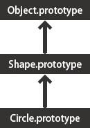

# Prototypes + Prototypal Inheritance

##Objectives

* Use prototypal inheritance to group shared properties even further
* Understand the process of calling parent classes from a constructor.
* Utilize various JavaScript methods in combination with prototypal inheritance.
* Explore the next generation of inheritance in JavaScript using ES6 classes.

## Review

We mentioned in the last lesson that a prototype was the building block of an object and that when we create a new class, we can attach attributes and methods to the prototype (as a better alternative to adding them in the constructor function to save memory).


### Review of a Constructor and Prototype In JS

In javascript we don't have classes, so we use constructor functions and prototypes to create them.
```js
function Person(name){
	this.name = name
}

Person.prototype.greet = function(){
	return "Hello, my name is " + this.name;
};
```

## Inheritance

### What is Inheritance, and why do we want to use it?

Inheritance is a way for objects to inherit properties from other objects. This allows for your code to be organized and prevent needless repetition.

For example, there are many types of boats in the world, but all of them have properties in common. We can organize our objects so that all the different types of boats (steamboat, sailboat, motorboat) inherit properties that they share, instead of repeating them in each object.

**The repetitive way**
```js
function Sailboat(length, width, sails) {
	this.length = length;
	this.width = width;
	this.sails = sails;
}

function Steamboat(length, width, smokeStacks) {
	this.length = length;
	this.width = width;
	this.smokeStacks = smokeStacks;
}

function Motorboat(length, width, motors) {
	this.length = length;
	this.width = width;
	this.motors = motors;
}
```

**The inheritance way**
```js
function Boat(length, width) {
	this.length = length;
	this.width = width;
}

function Sailboat(length, width, sails) {
	Boat.call(this, length, width);
	this.sails = sails;
}
Sailboat.prototype = Object.create(Boat.prototype);
Sailboat.prototype.constructor = Sailboat;


function Steamboat(length, width, smokeStacks) {
	Boat.call(this, length, width);
	this.smokeStacks = smokeStacks;
}
Steamboat.prototype = Object.create(Boat.prototype);
Steamboat.prototype.constructor = Steamboat;


function Motorboat(length, width, motors) {
	Boat.call(this, length, width);
	this.motors = motors;
}
Motorboat.prototype = Object.create(Boat.prototype);
Motorboat.prototype.constructor = Motorboat;
```

By using the inheritance method, not only do we group shared properties into another object, but we can attach functions to the superclass's object's prototype, and now all boats have that function!
```js
Boat.prototype.getDimensions = function() {
	console.log("This boat has a width of " + this.width + " and a length of " + this.length);
}
```

Now the Sailboat, Steamboat, and Motorboat can all use the `getDimensions` function, through what's called the **prototype chain**.



Whenever an object doesn't directly have a function or property, it traverses up the prototype chain to see if any parents have it. In this case, SailBoat, Steamboat, and Motorboat go up to their parent (Boat) and see that Boat has a `getDimensions` function.


### Inheriting Via Prototypes: A Closer look

We have previously mentioned that objects can inherit properties and methods from other objects. In JavaScript we use prototypes to do this and it is called inheritance. The formal term for this inheritance via prototypes is called prototypal inheritance.

Inheritance is done in a few steps

1. In the subclass (the child class that will get methods and properties from its parent), call the superclass (also known as parent class) using `call`

2. Set the prototype of the subclass to a new instance of the superclass

3. Set the constructor of the subclass equal to it's constructor function (which was overwritten when the prototype was set to the superclass)

Given the following example let's create a Student class that inherits from Person.
```js
function Person(name){
	this.name = name
}

Person.prototype.greet = function(){
	return "Hello, my name is " + this.name;
};

function Student(name, course){
	Person.call(this, name);
	this.course = course;
};

Student.prototype = Object.create(Person.prototype);
Student.prototype.constructor = Student;
```

Why do we reset the constructor? See [this](http://stackoverflow.com/questions/8453887/why-is-it-necessary-to-set-the-prototype-constructor) answer.

Why do we use `call` when calling the parent class? Why not just run `Person(name)`?

It all comes down to `this`. In our Person constructor, `this` refers to the name of the new Person object being created. However, inside the Student constructor, `this` refers to the new Student object being created.

`call` gives us a way to redefine what `this` represents. Let's dive more into the use of `call`, and its sibling, `apply`.

### `call` and `apply`

Example 1:

```js
var getAge = function(friend) {
	return friend.age;
}

var john = { name: "John", age: 21 };
var tom = { name: "Tom", age: 31 };
var bob = { name: "Bob", age: 41 };
getAge(john)
getAge(tom)
getAge(bob)
```

rewritten using `this`

```js
var getAge = function() {
	return this.age;
}

var john = { name: "John", age: 21 };
var tom = { name: "Tom", age: 31 };
var bob = { name: "Bob", age: 41 };
getAge.call(tom)
getAge.call(john)
getAge.call(bob)
```

Example 2:

```js
var setAge = function(friend, newAge) {
	friend.age = newAge;
}

var john = { name: "John", age: 21 };
setAge(john, 12)
```

rewritten using `this`

```js
var setAge = function(newAge) {
	this.age = newAge;
}

var john = { name: "John", age: 21 };
setAge.call(john, 12)
```

Apply works just like call, but your second parameter is an array of objects instead of a comma separated list.

### Calling on a solution

Let's talk about using `call` or `apply` to set the `this` context for a function before it is run.

```js
function Person(name){
	this.name = name;
	this.friends = [];
}

Person.prototype.addFriend = function(name){
	this.friends.push(new Person(name));
};

function Student(name){
	// masks all the constructor properties including name (as the second parameter)
	Person.call(this, name);
};

Student.prototype = Object.create(Person.prototype);
Student.prototype.constructor = Student;
```

### Useful methods when working with inheritance

### hasOwnProperty

Object.hasOwnProperty('nameOfProperty') - always make sure the name of the property is in quotes. Classes that inherit from other classes will also return true if the property is checked.

Example 1

```js
var taco = {
	food: "taco"
}

taco.hasOwnProperty(food); // returns an error
taco.hasOwnProperty("food"); // returns true
```

Example 2 with inheritance

```js
function Person(name){
	this.name = name
}

Person.prototype.greet = function(){
	return "Hello, my name is " + this.name;
};

function Student(name, course){
	Person.call(this, name);
	this.course = course;
};

Student.prototype = Object.create(Person.prototype);
Student.prototype.constructor = Student;

var p = new Person("Bob");
var s = new Student("Tom", "WDI");

p.hasOwnProperty("name"); //returns true
s.hasOwnProperty("course"); //returns true
s.hasOwnProperty("name"); //returns true
```

### instanceof

This method is a bit more common, and the syntax looks like this:

`object instanceof Class`

Example 1:

```js
var obj = {};
color1 instanceof Object; // returns true
```

Example 2 with inheritance

```js
function Person(name){
	this.name = name
}

Person.prototype.greet = function(){
	return "Hello, my name is " + this.name;
};

function Student(name, course){
	Person.call(this, name);
	this.course = course;
};

Student.prototype = Object.create(Person.prototype);
Student.prototype.constructor = Student;

var p = new Person("Bob");
var s = new Student("Tom", "WDI");

s instanceof Person //returns true
p instanceof Student //returns false
Person instanceof Object //returns true
String instanceof Object //returns true
Object instanceof Boolean //returns false
```

### isPrototypeOf

This method is used a bit less frequently, but the syntax looks like this:

```js
Object.prototype.isPrototypeOf(objectInstance);
```

Example:

```js
var p = new Person("Bob");
var s = new Student("Tom", "WDI");

Person.prototype.isPrototypeOf(s); // returns true
Student.prototype.isPrototypeOf(p); // returns false
```

You can read more about the difference between isPrototypeOf and isInstanceOf [here](http://stackoverflow.com/questions/2464426/whats-the-difference-between-isprototypeof-and-instanceof-in-javascript)


#### Some good additional reading

[http://geekabyte.blogspot.com/2013/03/difference-between-protoype-and-proto.html](http://geekabyte.blogspot.com/2013/03/difference-between-protoype-and-proto.html)

[https://developer.mozilla.org/en-US/docs/Web/JavaScript/Introduction_to_Object-Oriented_JavaScript#Inheritance](https://developer.mozilla.org/en-US/docs/Web/JavaScript/Introduction_to_Object-Oriented_JavaScript#Inheritance)

## Inheritance with ES6 and Babel

Other languages, such as C++ and Java, handle inheritance in a different way. Most OOP languages follow a class pattern, which contains the constructor and any methods shared across objects, as opposed to attaching methods to the prototype.

ES6, short for ECMAScript 6, is the latest update coming to JavaScript. ES6 provides a different way for implementing constructors and inheritance. An example is shown below. See resources such as [this one](http://javascriptplayground.com/blog/2014/07/introduction-to-es6-classes-tutorial/) for more details.

```js
class Person {
	constructor(name) {
		this.name = name;
	}

	greet() {
		return "Hello, my name is " + this.name;
	}
}

class Student extends Person {
	constructor(name, course) {
		super(name);
		this.course = course;
	}
}
```

Note that the parent/superclass constructor is called using the `super` keyword. Also, since ES6 isn't implemented across all platforms, this code won't work in many browsers. In order to write ES6 code now while still supporting older systems, we can use [Babel](https://babeljs.io/) to compile this code into ES5-friendly code.
