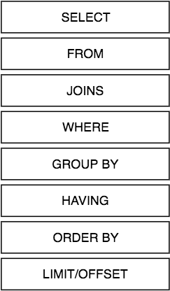

# Advanced SQL

## Objectives
* Utilize different ways to filter data in the WHERE clause
* Describe the uses of advanced queries like subqueries and unions
* Demonstrate ability to order data
* Demonstrate ability to aggregate and combine data

## Order of SQL Clauses



## Selecting specific data

Not equal - `<>`

```
- LIKE - SELECT * FROM students WHERE name LIKE '%';
- DISTINCT - SELECT DISTINCT name FROM students;
- ORDER BY - SELECT * FROM students ORDER BY name DESC;
- COUNT - SELECT count(*) FROM students;
- MAX - SELECT max(age) FROM students;
- MIN - SELECT min(age) FROM students;
- AND - SELECT * from students WHERE name = 'Elie' AND age = 26;
- OR - SELECT * from students WHERE name = 'Elie' OR name ='Mary';
- IN - SELECT * FROM students WHERE name IN ('Bob', 'Tom');
- NOT IN - SELECT * FROM students WHERE name NOT IN ('Bob', 'Tom');
- LIMIT - SELECT * FROM students LIMIT 2;
- OFFSET - SELECT * FROM students OFFSET 1;
- LIMIT + OFFSET - SELECT * FROM students LIMIT 2 OFFSET 1;
- % - SELECT * FROM students WHERE name LIKE '%b';
```

Let's suppose we have a *customer* table with the following data:

```sql
 id |  name   | age |  country  | salary 
----+---------+-----+-----------+--------
  1 | Ramesh  |  32 | Ahmedabad |   2000
  3 | Kaushik |  23 | Kota      |   2000
  2 | Ramesh  |  25 |           |   1500
  4 | Kaushik |  25 | Mumbai    |       
  5 | Hardik  |  27 | Bhopal    |   8500
  6 | Komal   |     |           |   4500
```

## COUNT()

COUNT() is an *aggregate function*.

"In database management an aggregate function is a function where the values of multiple rows are grouped together to form a single value of more significant meaning or measurement such as a set, a bag or a list." [Read more on wikipedia.](https://en.wikipedia.org/wiki/Aggregate_function)

We use an aggregate function to get the total count of customers in a table.
```sql
SELECT COUNT(*) FROM customer;
```

What about getting the count of something more specific in customer, such as the number of rows that have the age datapoint? 
```sql
SELECT COUNT(age) FROM customer;
```

## GROUP BY

GROUP BY is used to pull together identical data points. For example, say we just want to see the different ages we have in our customer table, without having to look through the duplicates too.
```sql
SELECT age FROM customer GROUP BY age;
```

What if we just want to know how many different ages we have? We can combine GROUP BY and COUNT():
```sql
SELECT age, COUNT(age) FROM customer GROUP BY age;
```

Or maybe we want the average salaries of the customers from each country:
```sql
SELECT country, AVG(salary) FROM customer GROUP BY country;
```

### Aliases

Aliases are a piece of a SQL query that allows you to temporarily rename a table or column for the current query.

```sql
SELECT country, avg(salary) AS avgSal FROM customer GROUP BY country;
```

### Alter Table Command

```sql
ALTER TABLE customer ADD COLUMN date DATE;

ALTER TABLE customer ALTER COLUMN name SET NOT NULL;

ALTER TABLE customer DROP date;
```

### FOREIGN KEYS
```sql
CREATE TABLE merch_order (
	id SERIAL PRIMARY KEY,
	num_items INTEGER,
	customer_id INTEGER REFERENCES customer(id)
);
```

### Nested queries

What if I want to get names of customers with the highest salary.

Let's try it using WHERE

```sql
SELECT name, salary FROM customer
WHERE salary = MAX(salary);
```

That will give us an error, because MAX is an aggregate function and can't be used in WHERE.

This will return the maximum rating, which we need to feed into WHERE.

```sql
SELECT name, salary FROM customer
WHERE salary = (
	SELECT MAX(salary) FROM customer
);
```

### Conditionals

#### CASE Statement
The CASE statement is used when you want to display different things depending on the data that you've queried from the database. There's two different ways to structure a CASE statement shown below. Note that in the first example you can only compare against single values while in the second example you can use actual expressions for evaluation. Also note that CASE statements require an ELSE statement.

```sql
SELECT name,
	age, 
		CASE WHEN age<25
		THEN 'young adult'
		ELSE 'adult' 
		END AS age_group 
FROM customer;
```


### INNER JOIN

INNER JOIN gives us the intersections of tables (or the rows that are the same in each table involved in the join).

Suppose we have a second table of subscribers like so:

```sql
 id |  name  | catalog | email 
----+--------+---------+-------
  1 | Ramesh | 0       | 1
  2 | Komal  | 1       | 0
  3 | Busak  | 1       | 1
  4 | Reg    | 0       | 1
  5 | Hardik | 1       | 1
 ```
 
And we want to see which of our subscribers have become customers.

```sql
SELECT customer.name 
FROM customer 
INNER JOIN subscriber 
ON customer.name=subscriber.name;
```

--

```sql
SELECT * FROM crew
    LEFT JOIN users photographer
        ON crew.fk_photographer = photographer.userID
    LEFT JOIN users director
        ON crew.fk_director = director.userID
    LEFT JOIN users model
        ON crew.fk_model = model.userID
ORDER BY crew.crewID ASC;
```

### Unions

Unions are the compilation of one or more disparate SQL queries that have the same columns. These are helpful when doing data aggregation that requires multiple SQL statements with different sets of joins and where clauses, but that return the same type of data.

Note: Unioned SQL statements MUST have the exact same columns (matching names) in the exact same order.

In the example below, I want all users and the number of photographs taken that they have "been a part of". In my first query I'm selecting photographers. In my second I'm selecting directors. In my third I'm selecting editors. But I want everything to display as just individual users with a 'role' column that I've manually set.

```sql
SELECT
	users.id,
	users.name,
    'Photographer' AS 'role',
	COUNT(photos.id) AS 'photoCount'
FROM photoShoots
	INNER JOIN users
		ON photoShoots.fk_photographerUserId = users.id
	INNER JOIN photos
		ON photoShoots.id = photos.fk_photoShootsId
GROUP BY users.id, users.name

UNION

SELECT
	users.id,
	users.name,
    'Director' AS 'role',
	COUNT(photos.id) AS 'photoCount'
FROM photoShoots
	INNER JOIN users
		ON photoShoots.fk_directorUserId = users.id
	INNER JOIN photos
		ON photoShoots.id = photos.fk_photoShootsId
GROUP BY users.id, users.name

UNION

SELECT
	users.id,
	users.name,
	'Editor' AS 'role',
	COUNT(photos.id) AS 'photoCount'
FROM photoShoots
	INNER JOIN users
		ON photoShoots.fk_editorUserId = users.id
	INNER JOIN photos
		ON photoShoots.id = photos.fk_photoShootsId
GROUP BY users.id, users.name;
    
```
