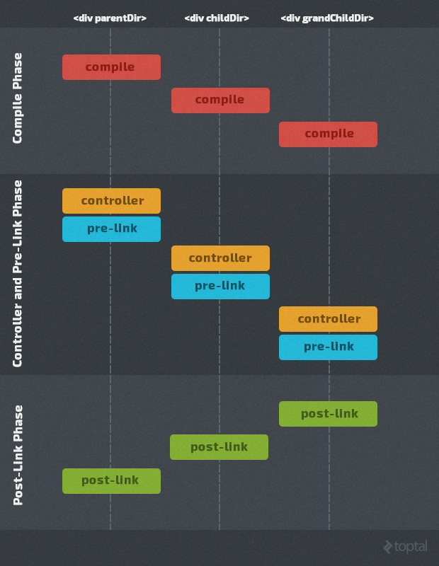

#Custom Directives

## Objectives
* Describe the different types of custom directives available
* Create a custom directive
* Explain why custom directives are valuable

## Modularity with Custom Directives

As you've seen by now, a huge amount of the code you work with in Angular are directives. Angular was designed to be an extension of HTML - a way to have custom-defined interactive tags of your own making.

While we've been getting good at using the directives that come with Angular, it's time to start seeing what we can do if we start making own own.

One of the most obvious _uses_ of this is when you've got repetitive code to render some information or data. If you're using a bunch of tags all over the place, it's a DRY principle – you might forget a tag or decide to change something and have to change it in a million places.

By extracting it to a custom directive, we can reference that directive whenever we need to use it and not worry about repeating the code to render it.

### Real World Example

As an example, we're going to mess around with duplicating something that's becoming a common pattern in interface design – the concept of a card. Applications like Twitter, Pinterest, Facebook, and a lot more are moving towards this design pattern.


Everyone's favorite CSS framework, Bootstrap, is even on board, where in [version 4+ you're able to create a card](http://v4-alpha.getbootstrap.com/components/card/) with just some CSS classes:


Let's see if we can make something similar, wrapped up in our own custom HTML element.

##Cards Against Assembly

####Starter Code

https://github.com/WDI-SEA/cards-against-assembly

Take five minutes and inspect our starter code. You'll see a pretty normal Angular app, and since we're repeating using those cards, and there's a few consistent tags we're repeating every time we render a card, we're going to experiment with making those cards a custom-defined directive.


## Building a Simple Directive

Using our starter code, our goal is to take:

```html
<div class='card'>
  <h4 class="card-title">{{card.question}}</h4>
  <h6>Cards Against Assembly</h6>
</div>
```

and end up with a reusable `<card></card>` component, maybe something like:

```html
<card question="{{card.question}}"></card>
```

### Let's be organized!

Rather than just throw this wherever, let's make a file dedicated to this directive.

```
touch js/cardView.js
```

### Directives are as easy as...

Just like controllers, factories, anything else we've made in angular, we're going to use a function to add another component. In this case, we'll make a `cardView` module and add a `directive` to it. That directive will have a function that returns everything related to the directive.

```js
angular.module('cardView', [])
.directive('card', function() {
  return {
    //stuff here
  }
});
```

An important thing to point out: The first argument of `directive` is the name of the directive and how you'll use it in your HTML; and remember, Angular converts `camelCase` to `snake-case` for us, so if you want to use `<secret-garden></secret-garden>` in your HTML, name your directive `.directive('secretGarden', ...)`.  Remember, in the official Angular docs it's called `ngClass` or `ngRepeat`, but in your HTML you use `ng-class` and `ng-repeat`.

## Directive Options

There's a few interesting options when making your own directives. We'll go through them all, quickly, and you can play with them on your own in a bit.

1. `restrict`
2. `replace`
3. `template/templateUrl`
4. `scope`

#### 1. `restrict`

While the name isn't obvious, the `restrict` option lets us decide what _kind_ of directive we want to make. It looks like this:

```js
restrict: 'AEC'
```

- `E` is element. An HTML element, like `<card></card>`
- `A` is attribute. Like `<div card="something"></div>`
- `C` is class. Like `<div class="card"></div>`

You can choose to have just one, all of the above, or any combination you like. You should steer towards elements & attributes as much as possible, though – classes can get messy with other CSS classes.

For ours, let's play with just an element.

```js
angular.module('cardView', [])
.directive('card', function() {
  return {
    restrict: 'E'
  }
});
```

#### 2. `replace`

Replace is pretty straightforward. Should this directive replace the HTML? Do you want it to get rid of what's in the template & swap it out with the template we're going to make? Or add to it, and not remove the original. For example, replacing would mean:

```html
<div ng-repeat="card in cards">
  <card></card>
</div>
```

Would actually render as:

```html
<div ng-repeat="card in cards">
  <div class='card'>
    <h4 class="card-title">{{question}}</h4>
    <h6>Cards Against Assembly</h6>
  </div>
</div>
```

See, replaced. Let's say we like that for our example:

```js
angular.module('cardView', [])
.directive('card', function() {
  return {
    restrict: 'E',
    replace: true
  }
});
```

#### 3. `template/templateUrl`

This is where our partial view comes in. Now, if it's a pretty tiny, self-contained directive, you can use `template: "Some javascript " + string + " concatenation";`

But that easily starts getting ugly, so it's often better (even for small directives like this) to make a quick little partial HTML file and reference it with `templateUrl` instead.

Let's extract our existing card tags, and throw them in a partial. Cut out:

```html
<div class='card'>
  <h4 class="card-title">{{card.question}}</h4>
  <h6>Cards Against Assembly</h6>
</div>
```

Quickly `touch cardView.html` or some similarly obvious-named partial, and paste it back in.

In `cards/cardView.html`:

```html
<div class='card'>
  <h4 class="card-title">{{card.question}}</h4>
  <h6>Cards Against Assembly</h6>
</div>
```

In `js/cardView.js`, we can add our option:

```js
angular.module('cardView', [])
.directive('card', function() {
  return {
    restrict: 'E',
    replace: true,
    templateUrl: 'cardView.html'
  }
});
```

And lastly, in our `index.html`, let's finally use our custom directive.

```html
<!-- index.html -->
<div class='col-sm-6 col-md-6 col-lg-4' ng-repeat="card in cards">
  <card></card>
</div>
```

Before testing out the directive, make sure that `index.html` has the script tag for the directive, and the directive module is injected into the app. Also, remember to run this using a **HTTP server**

In `app.js`:

```js
angular.module('CardsAgainstAssembly', ['CardCtrls', 'cardView']);
```

TRY IT! So awesome! We've now got this much more readable `index.html`, with a _very_ semantic HTML tag describing exactly what we want rendered.


This is awesome. This is a great, reusable component. Except for _one_ thing.

#### 4. `scope`

If you notice, our template uses ``{{card.question}}`` inside it. But what if we wanted to render a card somewhere outside of that `ng-repeat`, where `card in cards` isn't a thing. What if we want to render a one-off card, reusing our new directive elsewhere?

Just like controllers, we want to define what our scope is. We want to be able to say "Render a card, with these details, in whatever context I need to render it in." A card shouldn't rely on a controller's data to know what information to render inside it. The controller should pass that data to our directive, so it's freestanding and not relying on anyone but itself.

That's where `scope` comes in, and this lets us decide what attributes our element should have! For example, in our card example, maybe we want to render a card with just a string somewhere outside of this controller. We want to make our own card with our own hardcoded text.

Try this. In your `index.html`, adjust our `<card>` element to say:

```html
<card question="{{card.question}}"></card>
```

In context, you'll see that the `ng-repeat` is giving us the variable `card`, and we're actually just rendering that out as a string. But we've decided we want to have an attribute called `question` to pass data through. We made that up, it's appropriate to our example, but it can be anything.

There are only two other pieces we need to make this reality.

In our `cardView.html` partial, let's adjust to:

```html
<div class='card'>
  <h4 class="card-title">{{question}}</h4>
  <h6>Cards Against Assembly</h6>
</div>
```

No longer reliant on a variable named `card`, it's now just reliant on an element having the attribute of `question`.

And finally, in `js/cardView.js`:

```js
angular.module('cardView', [])
.directive('card', function() {
  return {
    restrict: 'E',
    replace: true,
    templateUrl: 'cardView.html',
    scope: {
      question: '@'
    }
  }
});
```

In `scope`, we just define an object. The key is whatever want the attribute on the element to be named. So if we want `<card bagel=""></card>`, then we'd need a key named `bagel` in our scope object.

#### The Different Types of Scope for a Directive
The _value_ is one of 3 options.

```js
scope: {
  myRecipient: '=', // Bind the ngModel to the object given
  onSend: '&',      // Pass a reference to the method
  fromName: '@'     // Store the value associated by fromName
}
```

The corresponding options would look like:

```html
<div scope-example my-recipient="to" on-send="sendMail(email)" from-name="ari@fullstack.io" />
```

The `=` is a mechanism for binding data that might change; the `&` is for passing a reference to a function you might want to call; and the `@` is simply storing a string & passing it through to the template.

#### Since we've decided to use `@`/strings, let's try it!

Our last test is to see if we can make a card using just a hardcoded string. Then we'll know our card is really reusable.

Somewhere _outside_ the context of the controller, let's say just above the footer in our `index.html`, throw a handmade card in:

```html
<!-- ... -->
</section>
<hr>
<card question="Why is Angular so awesome?"></card>
<footer>
<!-- ... -->
```


Would you look at that? Our own custom directive - a reusable, semantic HTML component that we designed ourselves.

##Before we continue... additional topics

Your homework will involve making directives with more functionality than just a card. In order to provide additional functionality, the `controller` property is incredibly useful for creating a separate controller for the entire directive.

Example:

```js
angular.module('cardView', [])
.directive('card', function() {
  return {
    restrict: 'E',
    replace: true,
    templateUrl: 'cardView.html',
    scope: {
      question: '@'
    },
    controller: ['$scope', function($scope) {
      //we can access 'question' or anything from scope via $scope.question
      //we can also create functions that are accessible within the template
      $scope.printQuestion = function() {
        console.log($scope.question);
      }
    }]
  }
});
```

Now if we update `cardView.html`, we can add this function to the template. Let's do so via the `ng-click` directive.

```html
<div class='card' ng-click="printQuestion()">
  <h4 class="card-title">{{question}}</h4>
  <h6>Cards Against Assembly</h6>
</div>
```

Try it out! We'll be making our own Facebook `like` button and a more complex `weather` directive in the homework using these concepts.

###Compile, Controller, preLink, Link

There are 4 life cycle functions that you can define for a directive. It's often confusing to understand when you should use which function. Sometimes, it doesn't make much of a difference. The key is understanding the order in which these functions are triggered.

Usually we'll only use `controller`, but compile, link, and pre-link are also available if we need to run code a a specific point in the life cycle.

It often doesn't matter which one we use, but understanding how these functions fire on nested directives is pretty helpful.

**Example**

```html
<parent-dir>
  <child-dir>
    <grand-child-dir></grand-child-dir>
  </child-dir>
</parent-dir>
```

**Execution Order**



## Conclusion
* Where can you imagine using custom directives?
* What four types of directives can you make?
* How do you pass information into a custom directive?
