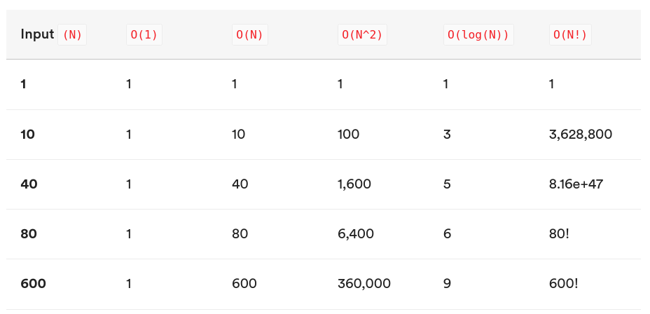

# Algorithm Complexity

## Objectives

* Review 'Algorithms'
* Analyze Algorithms in the terms of time and space
* Explain asymptotic behavior
* Use Big-O to compare the complexity of different algorithms

## What are Algorithms?

An algorithm is a procedure for solving a problem.

Specifically, it is a step-by-step set of operations to be performed. We've been creating algorithms, in one form or another, throughout this class.

Popular examples include various sorting and searching algorithms.

## What is Algorithm Complexity?

Whenever we create algorithms, we need to be aware that they run on computers that are limited in terms of time and space.

So far, most of the algorithms we've written seem to run instantaneously.

However, when dealing with issues like scalability, that "instant" algorithm can possibly take minutes or days to run if the data set is too large.

What we need to do is analyze what happens to an algorithm as the data grows unboundedly.

This is done in terms of:

* Runtime \(processing time, via the CPU\)
* Runspace \(how much memory does it take up\)

We use Big-O notation to analyze what happens in the worst-case scenario for an algorithms runtime as the input size grows.

## The Bird Analogy:

Let's say you want to send a file to your friends house, but your internet connection isn't very fast!

You only have two options:  
1. Send your friend the file over the internet. 2. Send your friend the file via a carrier pigeon.

When the file size is small, say a couple kilobytes or megabytes, sending your friend the file doesn't take that long!

It might take on the order of a few minutes to a few hours, but your friend gets it same day.

Compared to the carrier pigeon option, which may take a day to arrive at the destination, the choice is a no-brainer.

But what happens when your data size grows?

* How long will it take your friend to download a 1 gigabyte file?
* How about a 100 gigabyte file?
* A 1 terabyte file?

In the worst case scenario, it will take your friend days, weeks, possibly months to download your file.

Looking at the carrier pigeon option, it'll take a constant time of 1-day to deliver it's payload, no matter the size!

At this point, carrier pigeon is starting to make a lot of sense as a method of transportation!

## Big-O Notation

> In computer science, big O notation is used to classify algorithms by how they respond \(e.g., in their processing time or working space requirements\) to changes in input size. -- Wikipedia

How can we definitively say one algorithm will perform better than another, given an input of size `n`?

Let's analyze some charts to get an idea of how the number of operations needed grows as the input size `n` grows larger.

Note that when we use Big-O notation, we're only worried about the **asymptotic** behavior. In other words, the behavior as we approach infinity.

### Number of Operations at Various Input Sizes \(n\)



### Complexity Chart


Observe how curves for different complexities compare to each other.

* O\(1\) is a totally flat line. The time required is the same no matter how many inputs.
* O\(n\) goes up and right in a straight line.
* O\(log\(n\)\) goes up, then flattens out.
* O\(n2\) starts to spike up sharply as data gets large.

### O\(1\) - Constant Runtime

An algorithm that is `O(1)`, is said to be "Big O of 1" or **constant time**.

The amount of time required does not vary depending on the size of the input. This is the best case scenario where we'll maintain the same performance even for very large values of n.

```javascript
function constantRuntime(x) {
  var result = x * 2;
  return result;
}
```

### O\(N\) - Linear Runtime

An algorithm that is `O(n)`, is said to be "Big O of n" or **linear complexity**.

This indicated that the resources required grow proportionally to the size of the input at a 1:1 ratio.

```javascript
function linearRuntime(n) {
  for (let i = 0; i < n; i++) {
    console.log(i); // This operation runs n-times
  }
}
```

### O\(n2\) - Quadratic Runtime

An algorithm that is `O(n^2)`, is said to be "Big O of n squared" or **quadratic complexity**.

It means the number of operations grow in proportion to the square of the input. This is **slow**. Refer back to the chart above to see how quickly the required number of operations grows as `n` grows.

```javascript
function quadraticRuntime(n) {
  for (var i = 0; i < n; i++) {
    for (var j = 0; j < n; j++) {
      console.log(i * j); // This operation runs n^2 times
    }
  }
}
```

### O\(log\(n\)\) - Logarithmic Runtime

An algorithm that is `O(log(n))`, is said to be "Big O of log n" or **logarithmic complexity**.

It means the resources grow to the inverse of exponential growth.

This is **fast!**

Think of logarithmic algorithms as cutting the amount of work to do in half at each step of the way. Big numbers are quickly halved down to smaller and smaller numbers.

Binary search is a classic `O(log(n))` algorithm.

Imagine flipping through a phone book to find someone's number. A linear `O(n)` algorithm would start at the beginning of the phone book and read every name on every page until it found the name you're looking for. This is terribly slow!

Instead of reading every single name it's much easier to read one random name and flip far forward or backward depending on how close that name is to the name you're looking for.

This only works because the phone book is sorted by names. Imagine trying to do a reverse look up on a mysterious phone number using a phone book. You'd have to start at the beginning and look at every single entry!

One million can be split in half roughly twenty times before getting down to one. Imagine looking for a name in a phone book with a million pages and see how quickly the amount of pages left to look through goes down:

1,000,000 pages left 500,000 pages left 250,000 pages left 125,000 pages left 64,000 pages left 32,000 pages left 16,000 pages left 8,000 pages left 4,000 pages left 2,000 pages left 1,000 pages left 500 pages left 250 pages left 125 pages left 64 pages left 32 pages left 16 pages left 8 pages left 4 pages left 2 pages left 1 page left

<!--

Below is an implementation of Binary Search in Js:

```javascript
function binarySearch(arr, search) {
  var min = 0;
  var max = arr.length - 1;
  var index;
  var elem;

  while (min <= max) {
	index = Math.floor((min + max) / 2);
	elem = arr[index];

	if (elem < search) {
	  min = index + 1;
	}
	else if (elem > search) {
	  max = index - 1;
	}
	else {
	  return index;
	}
  }

  return -1;
}
```
-->


### O\(n log\(n\)\) - Efficient Sorting Algorithms

This is one of the most common measures of complexity.

It usually appears when dealing with sorting algorithms.

Think of an `n log(n)` algorithm as having to do the equivalent work of a binary search once for each input, or `n` times.

It performs an `log(n)` operation `n` times, so we multiply them together.

See the [Big O Cheat Sheet](http://bigocheatsheet.com/) for some other common time \(processing time\) and space \(memory\) complexities and their notations.

