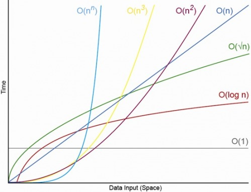

#Algorithm Complexity

##Objectives

* Explain what algorithms are
* Understand the need to analyze algorithms and their complexity in terms of time and space
* Explain why asymptotic behavior is observed
* Use Big-O to explain the complexity of different algorithms

##What are Algorithms

An algorithm is a procedure or formula for solving a problem. Specifically, it is
a step-by-step set of operations to be performed. We've been creating algorithms,
in one form or another, throughout this class.

##What is Algorithm Complexity?

Whenever we create algorithms, we need to be aware that they run on computers, and
computers have limits in terms of time and space. Even though most of the algorithms
we've written seem to run instantaneously, when dealing with concepts like scalability,
that "instant" algorithm can possibly take minutes or days to run if there's too much
data provided to it.

What we need to do is analyze the complexity of the algorithm so we can estimate how
efficient it is. This is done in terms of:

* Runtime (processing time, via the CPU)
* Runspace (how much memory does it take up)

The most common way to express the efficiency/complexity of an algorithm is using what
is called Big-O Notation

##Big-O Notation

> In computer science, big O notation is used to classify algorithms by how they respond
(e.g., in their processing time or working space requirements) to changes in input size. -- Wikipedia

Since a big issue when discussing algorithms and data structures is their efficiency in
the face of certain tasks, we want to use a common language to discuss such (in)efficiencies.
Normally, we are interested in how much memory or processing time is needed to complete the
task depending on the size of the input. We often let n represent the input size.

Note that when we use Big-O notation, we're only worried about the **asymptotic** behavior.
In other words, the behavior as we approach some type of limit. Therefore, we don't worry
too much about coefficients in Big-O notation (You'll rarely see an algorithm analyzed as
O(3n). It simplifies down to just O(n)).

###Common Notations

|Input Size (n)|O(1) | O(log(N)) | O(Nlog(N)) | O(N)   |Time Taken (N<sup>2</sup>) |
|--------------|-----| ----------| -----------| ------ |---------------------------|
| 1            |1    | 1         | 1          | 1      | 1                         |
| 10           |1    | 3         | 30         | 10     | 100                       |
| 40           |1    | 5         | 50         | 40     | 1600                      |
| 80           |1    | 6         | 60         | 80     | 6400                      |
| 600          |1    | 9         | 90         | 600    | 360000                    |
| 10,000       |1    | 13        | 130        | 10,000 | 100,000,000               |

Observe how curves for different complexities compare to each other.

* O(1) is a totally flat line. It's constant no matter how much
  data is given to it.
* O(log(n)) goes up, then flattens out.
* O(n) goes up and right in a straight line.
* O(n<sup>2</sup>) starts to spike up sharply as data gets large.



#### O(1) - Constant Runtime

An algorithm that is O(1), is said to be "Big O of 1" or **constant**, and does not vary
depending on the size of the input. This is good. This is fast even for very large values
of n.

```js
function constantRuntime(x) {
  var result = x * 2;
  return result;
}
```

#### O(N) - Linear Runtime

An algorithm that is O(n), is said to be "Big O of n" or **linear**, and this indicates
that the resources required grow proportionally to the size of the input. This is reasonable
performance.

```js
function linearRuntime(x) {
  for (var i = 0; i < x; i++) {
    console.log(i);
  }
}
```

#### O(n<sup>2</sup>) - Quadratic Runtime

An algorithm that is O(n^2), is said to be "Big O of n squared" or **quadratic**,
and it means the resources grow in proportion to the square of the input. This is
**slow**. Think of really big numbers and then think of them squared.


```js
function quadraticRuntime(x) {
  for (var i = 0; i < x; i++) {
    for (var j = 0; j < x; j++) {
      console.log(i * j);
    }
  }
}
```

#### O(log(n)) - Logarithmic Runtime

An algorithm that is O(log(n)), is said to be "Big O of log n" or **logarithmic**,
and it means the resources grow to the inverse of exponential growth. This is **fast!**
Algorithms that grow this slow are great!

Think of logarithmic algorithms as cutting the amount of work to do in half
at each step of the way. Big numbers are quickly halved down to smaller and smaller
numbers.

Binary search is a classic O(log(n)) algorithm.

Imagine flipping through a phone book to find someone's number. A linear O(N) algorithm
would start at the beginning of the phone book and read every name on every page until
it found the name you're looking for. This is terribly slow!

Instead of reading every single name it's much easier to read one random name
and flip far forward or backward depending on how close that name is to the name
you're looking for.

This only works because the phone book is sorted by names.
Imagine trying to do a reverse look up on a mysterious phone number using a
phone book. You'd have to start at the beginning and look at every single entry!

One million can be split in half roughly twenty times before getting down to one.
Imagine looking for a name in a phone book with a million pages and see how quickly
the amount of pages left to look through goes down:

1,000,000 pages left
500,000 pages left
250,000 pages left
125,000 pages left
64,000 pages left
32,000 pages left
16,000 pages left
8,000 pages left
4,000 pages left
2,000 pages left
1,000 pages left
500 pages left
250 pages left
125 pages left
64 pages left
32 pages left
16 pages left
8 pages left
4 pages left
2 pages left
1 page left

Here's an actual implementation of using binary search to look for things
efficiently in an array in JavaScript:

```js
function binarySearch(arr, search) {
  var min = 0;
  var max = arr.length - 1;
  var index;
  var elem;

  while (min <= max) {
    index = Math.floor((min + max) / 2);
    elem = arr[index];

    if (elem < search) {
      min = index + 1;
    }
    else if (elem > search) {
      max = index - 1;
    }
    else {
      return index;
    }
  }

  return -1;
}
```

#### O(n log(n)) - Efficient Sorting Algorithms

This is another common measure of complexity. It usually appears when dealing
with sorting algorithms. Think of an `n log(n)` algorithm as doing a binary search
for each thing in an array. It performs an `log(n)` operation `n` times, so we
multiply them together.

See the [Cheat Sheet](http://bigocheatsheet.com/) for some other common time
(processing time) and space (memory) complexities and their notations.
