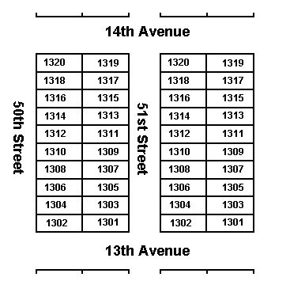

#Stacks and Queues

##Objectives

* Describe arrays in the context of lower-level languages (C++, Java)
* Memorize the acronyms LIFO and FIFO and how they apply to stacks and queues
* Use data structures to implement stacks and queues

##Memory and Arrays

So far, we've used arrays in JavaScript, which act as flexible containers for
storing data. However, arrays in many lower-level languages (C++, Java) do not
act like this. They are fixed in length, and we need to explicitly define the
size on creation.

To understand why this is the case, let's look at how memory is stored in a
computer.



Memory is stored in a block-like fashion, similar to city blocks. Each block
has buildings with "addresses", and each block has a fixed length that can't be
changed unless destroyed.

Memory in a computer is similar. When we allocate memory, we allocate "blocks".
Each block has a fixed size, generally enough to store the type of data we're
using. Each block has an address. And note that since the blocks are fixed and
uniform, we can only have arrays of a specific data type in C++ and Java (no
combining strings and integers in the same array).

###Does JavaScript do this?

JavaScript also allocates arrays as blocks of memory. However, since there's
lots of flexibility, there is additional overhead in JavaScript, when it comes
to **allocation** and **deallocation**. [This MDN article](https://developer.mozilla.org/en-US/docs/Web/JavaScript/Memory_Management) is a great resource that goes into this in-depth.

##Stack
Arrays are the foundation for implementing a container called a **stack**.
Stacks are special arrays where items can only be added and removed from the
end. This is a LIFO (last in, first out) procedure.

Adding the constraint that items are only added and removed from the end of
the array guarantees that adding and removing items is always an O(1) operation.
Adding a constraint on how data can exist becomes an optimization!

Consider what it means to have an array that represents a list of things that
allows you to add or remove things from the middle of the list. If things are
added and removed in the middle, then things have to be scooted around to make
room for new things, and things need to be condensed together when something is
removed. A list that supports adding and removing elements in the middle has a
complexity of O(N) because you could potentially have to move every single item
in the list to make room for a new item, or to condense the list after an item
has been removed.

Again, the whole idea of a Stack is that it takes a list and tells people that
they're only allowed to either add something to the end, or take something off
of the end. Since these operations are constrained to the end of the list
the rest of the items never have to scoot over, or condense. Adding and removing
off of the end is guaranteed to always be a constant O(1) operation.

Stacks traditionally have special names for the add and remove methods: **push**
and **pop**. Stacks are often visualized vertically, like a stack of cafeteria
trays, to indicate that the only item accessible is what's on top of the stack.

* **push** - push something on top of the stack
* **pop** - pop something off the top of the stack


## Stacks in JavaScript
Whenever we talk about data structures there's always two things:

* the idea and formal definition of the data structure.
* the implementation of the data structure.

The idea and formal definition of a data structure is an idea that can be
applied across all programming languages. The implementation of a data
structure refers to how the idea of the data structure actually exists in a
given language.

In JavaScript, you can represent a Stack using an array and only using the
`.push()` and `.pop()` methods. If you ever accessed the array using `a[index]`
or `a.splice()` or anything then you're cheating and you're not really following
the idea of a Stack.

In Python, you can represent a Stack using a list and restricting yourself to
only using the `.append()` and `.pop()` methods.

You can also create your own simple class in Python to implement the behaviour
of a Stack yourself, and guarantee people using your program only use Stack-like
methods.

```python
class Stack:
  def __init__(self):
    self.data = []
    
  def push(self, value):
    self.data.append(value)
    
  def pop(self):
    if len(self.data) > 0:
      return self.data.pop()
    return None
    
  def size(self):
    return len(self.data)
    
  def __len__(self):
    return self.size()
```

```python
ss = Stack()
ss.push(42)
ss.push(91)
ss.push(32)

ss.pop() # 32
ss.pop() # 91
ss.pop() # 42
ss.pop() # None
```

###Practical Applications for Stacks
Different data structures are good at different things. It can be beneficial
to confine oneself to using a specific data structure while solving a problem
because it may naturally lead to more efficient code, or it may make our code
less prone to errors. Becoming familiar with different data structures and
learning when they're useful will make you a better programmer.

Also, there's lot of algorithms designed specifically for data structures.
If you study data structures and algorithms you may find well-tested answers
for a wide variety of problems you want to solve.

Here's some problems Stacks are especially good at solving:

* Bracket matching
* Keeping track of undo/redo operations
* [Tower of Hanoi](https://en.wikipedia.org/wiki/Tower_of_Hanoi)

##Queue
A **queue** is another type of container generally implemented with a linked
list, but can be implemented with arrays. Items are only added to the end of a
queue, and only removed from the beginning of the queue. This is a FIFO (first
in, first out) procedure.

Queues normally support these two operations:

* **enqueue** - add something at the back of the line.
* **dequeue** - remove something from the front of the line.


Queues can be implemented in JavaScript with an array by using only the `push`
and `shift` functions to `push` (enqueue) something at the end of the list,
and `shift` (dequeue) something from the front of the list.

Python has a class in it's collections library called `deque` that stands for
"double ended queue." It has an `.append()` method to enqueue something to end
of the line and a `.popleft()` method to dequeue something off the front of the
line.

The Python docs say that `deque` is "A list-like sequence optimized for data
accesses near its endpoints." It's called a double ended queue because it
actually supports adding and removing elements to just the front and back of
itself. Since it doesn't involve rearranging things in the middle, this is
still able to maintain an efficiency of O(1).

Here's a small Python class that wraps around the `deque` object to create
**enqueue** and **dequeue** method names around the provided Python object.

```python
from collections import deque

qq = deque()
qq.append(1)
qq.append(2)
qq.append(3)

# First in, first out.
qq.popleft() # 1
qq.popleft() # 2
qq.popleft() # 3
```

###Practical Applications for Queues

* Representing a line
* Buffers for print jobs, or other tasks

## Using Stacks and Queues Together
Stacks and queues often appear together. Check this out. You can reverse
everything in a stack by running it through a queue!

Stacks and queues normally use while loops that run until the size of the
stack or queue is zero when they're all emptied out.

```python
from collections import deque

stack = []
stack.append(1)
stack.append(2)
stack.append(3)
stack.append(4)
stack.append(5)

qq = deque()
while len(stack) > 0:
  qq.append(stack.pop())
  
while len(qq) > 0:
  stack.append(qq.popleft())
  
while len(stack) > 0:
  print(stack.pop()) # prints 5, 4, 3, 2, 1
```

#Challenge: Bracket Matching

Define a function called `test_brackets` that takes a string and determines
if all brackets are correctly matching / nested (returns `True` or `False`).
This is code could be used as part of a system to detect syntax errors in code.

It should check for the following: `[ ]`,`{ }`,`( )`

* Use a Stack data structure
* Opening characters are left-parens, left-brackets, left-curly-braces
* Closing characters are right-parens, right-brackets, right-curly-braces
* Push opening characters onto the stack when you see them
* When you see a closing character see if it matches what's popped off the stack.
* Ignore any character that's not an opening character or a closing character.

###Usage Examples

```python
# True
test_brackets('abc(123)')

#returns True
test_brackets('a[bc(123)]')

#returns True
test_brackets('a{b}{c(1[2]3)}')

#returns True
test_brackets('()')

#returns True -- no brackets = correctly matched
test_brackets('abc123yay')

#returns False -- missing closing bracket
test_brackets('abc(123')

#returns False -- inproperly nested
test_brackets('a[bc(12]3)')

#returns False -- inproperly nested
test_brackets('a{b}{c(1}[2]3)')
```

# Challenge: Josephus problem
In the Josephus problem from antiquity, n people are in dire straits and agree
to the following strategy to reduce the population. They arrange themselves in
a circle (at positions numbered from 0 to n−1) and proceed around the circle,
eliminating every `Mth` person until only one person is left. Legend has it that
Josephus figured out where to sit to avoid being eliminated.

Define a function called `josephus` that accepts a list of people's names, and
a number `M`. Your function should simulate the population reduction strategy,
going around in a circle and eliminating every `Mth` person and finally
returning the name of the final person left.

Start counting with 1 at index zero so `josephus(["Jack", "John"], 1)` returns
"John" because "Jack" was eliminated on the first count.

Hint: put all of the names in a queue. Cycle through the names by dequeueing
names and immediately enqueueing them, unless they should be eliminated.

It may help you to start out your program printing out something like this, so
you can see what's going on:

```
josephus(["James", "John", "Mike", "Josephus"], 1)
1 James is eliminated
1 John is eliminated
1 Mike is eliminated
Josephus is the only one left.

josephus(["James", "John", "Mike", "Josephus"], 2) # returns "James"
1 James is skipped
2 John is eliminated
1 Mike is skipped
2 Josephus is eliminated
1 James is skipped
2 Mike is eiliminated
James is the only one left.

josephus(["James", "John", "Mike", "Josephus"], 3) # returns "James"
1 James is skipped
2 John is skipped
3 Mike is eliminated
1 Josephus is skipped
2 James is skipped
3 John is eliminated
1 Joshephus is skipped
2 James is skipped
3 Joshephus is eliminated
James is the only one left.
```

This long one should return "Mary".

```
josephus(["Peter", "Paul", "Mary", "Abba", "Prince", "Sting", "Beck"], 57)
```
