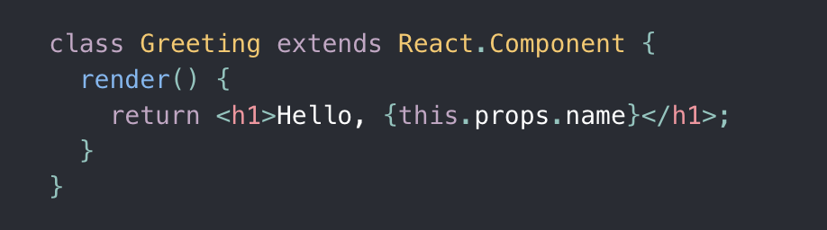
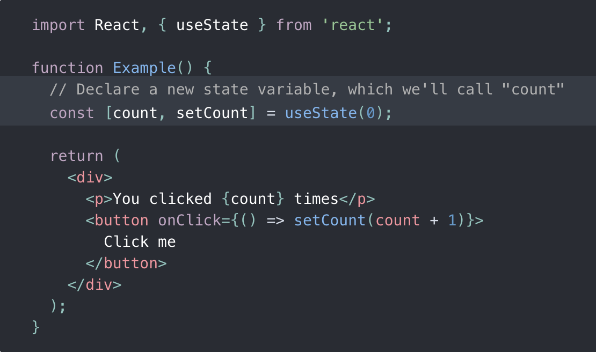

#  React Explainer

----
# :crystal_ball: Overview 

React.JS is a frontend framework that utilizes a virtual DOM and JSX to build a component based UI. 

React is an open source javascript library developed internally at Facebook to build scalable UIs - the internal tagline was "build once, use everywhere." Components are built to be reused, and also scale to mobile via React Native.

---
# History of React

React was developed internally at Facebook to lower development issues around UI structures on their frontend. 

Frontend UIs are hard to test, making them hard to reuse accross teams. This became a larger point of interest for Facebook with the Instagram and WhatsApp acquitions, followed by the push for Facebook Messenger growth. The development team needed a way to better standardize not just their styling, but their UI rules and functionality.

*Why does the history of React matter?* Because the history informs alot of how and why we currently use React, and also the future of React and frameworks built on top of React. 

### :calendar: React Development Timeline:
- **2011-2015**: Facebook developes React internally; builds stable release for outside users. 
- **2016-2018**: 
    * :star: *Class Based Components Era*. 
    * [React experiences spike in popularity](https://2017.stateofjs.com/2017/front-end/results), alongside rise in third party libraries based on React. 
    * [Next.JS](https://vercel.com/blog/next) released in 2016; [Gatsby.JS](https://www.gatsbyjs.com/blog/gatsby-v1) released in 2017.
    * Some questions come up around open source license; [Facebook is forced to address when Wordpress (Automatic) adopts, and then drops, React because of licensing issues](https://thedevcouple.com/interview-react-team-facebook-wordpress-gutenberg/).
- **October 2018**: [Functional components and hooks are released with React 16.8 at React Conf 2018](https://www.youtube.com/watch?v=dpw9EHDh2bM&feature=emb_title_).
- **Spring 2019**: Functional components and hooks begin to hit production apps.
- **Summer 2020 to Present (Winter 2021)**: 
    * [Internal issues with React team at Facebook become public](https://www.buzzfeednews.com/article/ryanmac/facebook-employee-leaks-show-they-feel-betrayed). 
    * [Jordan Walke](https://twitter.com/jordwalke/status/1347695301436456963?s=20) and other key leaders leave Facebook (with Dan Abramov taking light break from day to day development. 
    * **Why does this matter?** No feature releases of consequence over the past year, futher opening space for frameworks built on top of React to grow.
---
# :computer: Frontend Frameworks

React is a **Frontend Framework** - what does that even mean?

*What is a Frontend Framework?*
    A frontend framework is pre-written code that will typically include a build system and constructors to build out frontend UIs.

*What is the difference between a Frontend Framework and HTML/CSS/Javascript?* 
    HTML/CSS/Javascript apps (also known as *"vanilla web apps"*) are loaded and rendered by our web browsers (Chrome, Firefox, Safari, etc.). 
    Frontend framework apps take your code and either apply pre-written code to render on the frontend (Example: [Bootstrap](https://getbootstrap.com/docs/4.0/getting-started/introduction/)), or run a script on Node to build a version of the app that is HTML/CSS/JS.  

*What are some other Frontend Frameworks?* Other [popular](https://2020.stateofjs.com/en-US/technologies/front-end-frameworks/) frontend frameworks include:

- [Vue](https://vuejs.org/)
- [Svelte](https://svelte.dev/)
- [Angular](https://angular.io/)

---

# Class Based Components vs Functional Components

With the release of React 16.8, there are now two ways to declare components in React: Class Based or Functionally.

Most major updates to languages or frameworks take multiple years for popular adoption to start, but with React, because the update was easy to implement and a substantial improvement in preformance/readability, popular adoption started almost imediately. 

This means a lot of companies are actively updating their React codebases to use functional components from class based ones; others continue to use class based components, and others, still, started with functional components entirely. 

Class Based Component | Functional Component
--- | ---
 | 
How components were written pre-release of hooks and functional components in React 16.8. |  Components declared in function declerations; able to use hooks. Introduced in 2018, popular adoption started Spring 2019.
 
---

# Extra Resources

Quick hit of extra resources for those interested in learning more about React (both the technical and the non-technical):
- Mini-look at the current React team at Facebook: https://react.christmas/2020/24
- React docs: https://reactjs.org/docs/getting-started.html
- Remember, React is open-source. Check out the React Github: https://github.com/facebook/react

---
_This markdown was written by Anna Zocher._
