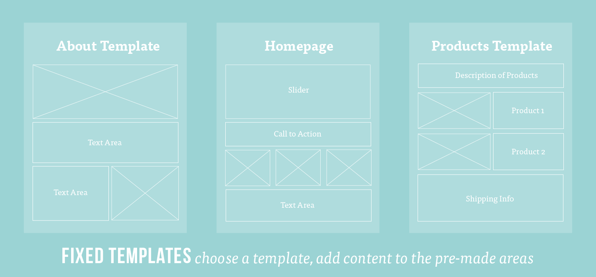
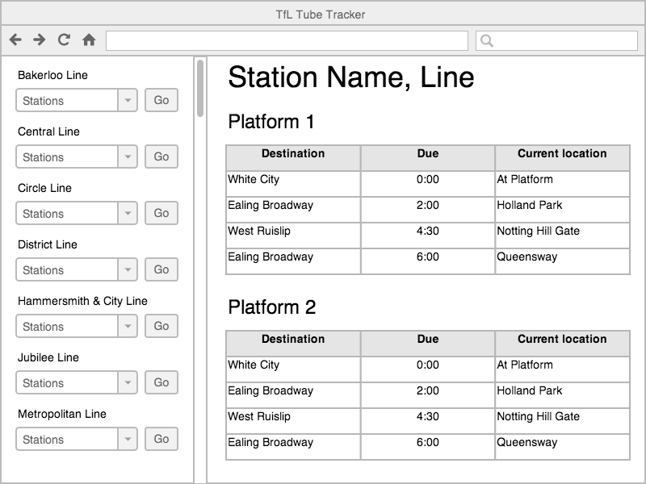
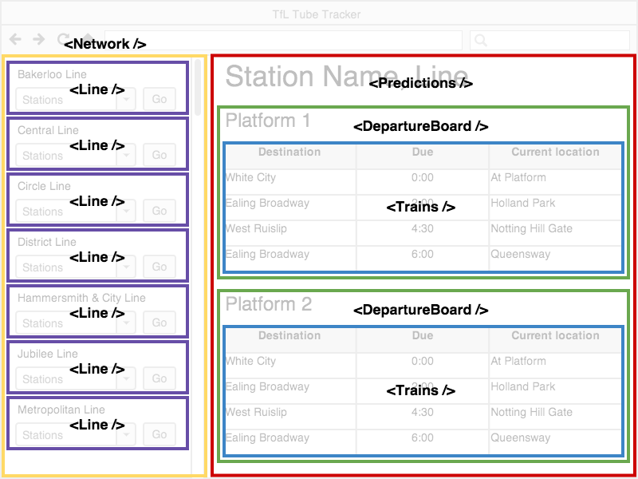

[](https://generalassemb.ly/education/web-development-immersive)

# Intro to React

We're going to build off of the fundamentals of front end development that we
gained in the last unit. But, with the help of React, we'll be able to build
more interesting UIs. React is a very powerful tool.

## Prerequisites

- JavaScript
- HTML & CSS

## Objectives

By the end of this, developers should be able to:

- Explain what a front end framework is and why they are useful
- Explain what ReactJS is and it's key concepts
- Explain the component model of web development

## Introduction

React is a front end framework, meaning it's a tool that helps us build front
end web applications. Your last few projects have all had front ends
that used "Vanilla" HTML, CSS, and JavaScript. This is a powerful way of
building web applications, but it has some limitations:

- You have to do a lot of manual updates to the DOM to update the UI
- You have to manually manage application state

Front end frameworks, like React, try to alleviate the amount of manual work the
developers have to do.

## What is a Front End Framework?

A framework is software (i.e. code someone or many people wrote) that provides
generic functionality and structure. That software acts as a foundation for
other developers to build applications on top of.

Frameworks can help standardize code, give you additional functionality and
performance, and can help get your code off the ground faster.

There are [many](https://stateofjs.com/2017/front-end/) front end frameworks and
each go about solving problems of how state is managed, updated, and displayed
on the page in their own way, but there are many commonalities.

There is a lot of debate over whether frontend frameworks count as frameworks at
all - some people say that they are just libraries and should be referred to as
such.

### What is ReactJS

React is a JavaScript framework used to craft modern day UI and views for the
front-end in web applications.

**Selling Point:** By modeling small compatible components that focus on just
rendering a view, we can move business logic out of the DOM, and therefore
improve our app's performance, maintainability, modularity and readability.

## Components

All front end frameworks provide their unique approach to managing front end
applications. In React, this is **components**.

So far, we've built out our websites and applications with separate HTML, CSS,
and JavaScript files. The HTML files contained all the HTML for a given page,
all in that one file. When we open our app in the browser, the whole page gets
loaded.

A core part of React's philosophy is to break everything up into smaller pieces,
called components.

You can think of a component as a small piece of a webpage that has a singular
purpose. It can be as little as a single `<input>` field or as big as a sidebar
containing other components.

Yes, components can hold other components! In fact, you should strive to have
lots of small components that you can nest within each other.



The traditional way of building out web pages. Each file contains all the code
for a single page. If there is duplication across pages, that code is duplicated
in the HTML.


> [WanderOak - Fixed Templates vs. Components](https://wanderoak.co/fixed-templates-vs-components/)

Our bright future! With components, we define them once (each React component
should be defined in its own set of files), and we can reuse them as many times
as we want, on different pages.

When we need to make updates, we only have to make those updates in one file.

### Examples

Let's take a look at an example web app and see how it might be broken down into
components.

Here is a wireframe for a given web app:



As you can see there are a lot of pieces of the user interface that are
repeated.

With React, we can break this wireframe up into those component pieces:



> [MakeTea - Building Robust Apps with React](http://maketea.co.uk/2014/03/05/building-robust-web-apps-with-react-part-1.html)

Notice the structure of how the various components are nested:

```
- TubeTracker
    - Network
        - Line
    - Predictions
        - DepartureBoard
            - Trains
```

- TubeTracker contains the application
- Network displays each line on the network
- Line displays the stations on a line
- Predictions controls the state of the departure board
- DepartureBoard displays the current station and platforms
- Trains displays the trains due to arrive at a platform

## Exercise: Identifying Components (15 min / 0:40)

> 10 minutes exercise. 5 minutes review.

With the person sitting next to you, take a look at Facebook, Craigslist, Ebay,
or a website of your choice. Identify the visual "components" the website is
comprised of. You can use [JustPaste](https://justpaste.it/) to build out a nested list of the components you create

As you're drawing this out, think about the following questions:

- Where do you see "nested components"? Where do you not?
- Are there any components that share the same structure?
- Of these similar components, what is different about them?

## Additional Resources

- [React Documentation](www.reactjs.org/docs)
- [Building robust web apps with React: Part 1, in-browser prototypes](https://www.matthinchliffe.dev/2014/03/05/building-robust-web-apps-with-react-part-1.html)

## [License](LICENSE)

1. All content is licensed under a CC­BY­NC­SA 4.0 license.
1. All software code is licensed under GNU GPLv3. For commercial use or
   alternative licensing, please contact legal@ga.co.
