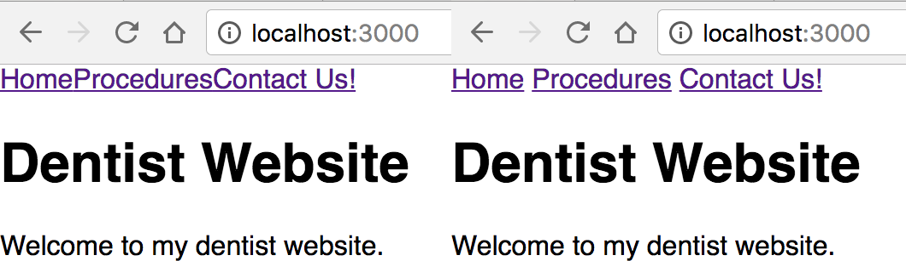

# React Router \(lesson and full codealong\)

##  React Router

#### Learning Objectives

_After this code-along section, you will be able to:_

-   Describe React Router's main features: routing, components, history
-   Use React Router to map URLs to components
-   Use React Router to create links to different pages

### React Router

It's great that HTML5 introduced new browser history mechanics to make it easier for us as developers to build Single Page Applications, and it's important to know what's going on under the hood.

However, on an important note - we're actually not going to be using these new features directly ourselves!

Instead, we'll use a tool called **React Router**, which bundles everything together so we don't have to worry about it.

For an intro to React Router, watch [this video](https://generalassembly.wistia.com/medias/tep72w77ir)

**React Router** is a third party library that makes it easy for us to route URLs - not to different pages, but by dynamically loading different components on the same page as the user navigates to different URLs. Once we define how the URLs are routed to the components, **React Router** will manage our Single Page App's browser history automatically.

Here's what React Router provides:

-   **Routing:** easily define what content is associated with what URLs.
-   **History:** automatically manage browser history when the user navigates between content.

React Router is actually a **third-party** library. "Third-party" just means it's not built by React and not built by ourselves; it was written by some other "third-party" group of developers. Even though React Router is third-party software, it's extremely useful, trustworthy, and popular - don't be afraid to use it. With more than 20,000 stars on Github, it’s safe to assume React Router is here to stay.

So let's use it!

### The Plan: Our Example Dental Spa

We're going to make an example website for a Dental Spa business that has:

-   A `Home` page.
-   A page that lists available `Services`.
-   A page displaying `Contact` information.

Each of these pages of content will be built into their own regular React component; then we'll create a unique URL route that leads to each component.

Here's how we'll route our single-page application:

| **URL Route** | **Component**  | **Content Description**                                                   |
| :------------ | :------------- | :------------------------------------------------------------------------ |
| /             | `<Home />`     | A homepage with welcome text.                                             |
| /services     | `<Services />` | A list of all services provided by the dental spa.                        |
| /contact      | `<Contact />`  | A page with an address, phone number, and email.                          |
| /services/:id | `<Service />`  | Will render beneath `Services` and shows details about a specific service |

Remember, the URL routes are paths off our main website. We could put our website at any domain, like `www.ourdentistwebsite.com` or `www.premiumdental.com`, and the URL route paths would behave the same. Paths only care about what comes after the domain name.

Our routes say that if someone goes to `ourdomain.com/` they will see our home page with welcome text.

-   The content of this page will all be defined in its own `Home` component in a file called `Home.js`.
-   If someone navigates to the URL `ourdomain.com/contact`, they will see content with the business address, a phone number, and an email. All of this content will be defined in a component called `Contact` in a file called `Contact.js`.

In the below codealong, we will walk through building this out together.

You can see a live working copy of the site [here](https://dental-spa.vercel.app/).

You are going to follow along, so that you have a locally working React Router application! However, if you'd like at any point to refer to the finished code, you can see all of the final code [here](https://github.com/WDI-SEA/v6-dental-spa).

### In Your Terminal

> Remember to stop any React project you currently have running!

Now let's make the dentist project. In your terminal, use `create-react-app` to make a new project called `dental-spa`:

```bash
$ npx create-react-app dental-spa
$ cd dental-spa
$ npm start
```

Your browser should open to [http://localhost:3000/](http://localhost:3000/) and you'll see the standard "Welcome to React" message with a fancy rotating atomic icon. `create-react-app` creates several files for us in a directory called `src`. Open the `App.js` file in your editor.

Remember, `App.js` contains our main application \(it's what's called by `index.js`\). You should see the basic JSX structure of the standard React starter page. Make sure the file is the same thing you're looking at in the browser by finding the text `Welcome to React` inside an `<h2>` element.

Change the text to say `Hello!`, save the file and make sure you see the changes automatically appear in your browser.

> If it doesn't automatically refresh, then try to manually refresh the page. If you still don't see changes after a manual refresh then something could be wrong. Make sure you're editing the right file.

**Pro tip:** It's a good idea to make simple, verifiable changes like this when you're first starting a project. It's a good sanity check.

Make sure you can do simple things first. Don't start with complex things; complex changes come with greater potential for error. Prove to yourself the small changes work, and you'll save yourself headaches debugging large complex changes.

## Installing React Router

Let's install **React Router**.

Since React Router is a third-party library, we'll need to download React Router and save it as a dependency in our project.

In your terminal, enter:

```bash
$ npm install react-router-dom
```

> You can either create a new tab in your terminal or hit `ctrl-c` to stop the running app, to use the terminal!

## Create Custom Homepage

Let's start the app again. Enter the command `npm start` in your terminal.

Let's get rid of the standard "Welcome to React" page and replace it with our own dental spa home page. Continue editing `App.js`: take out most of the JSX contents, and delete the import statement for `logo.svg`, which we won't use.

The `App.js` file contains one component that our whole app will live inside of. Remember that React functional components use `return( ... )` which defines what the component will look like when it is rendered on the webpage.

> Reminder! The return can send _at most_ one top-level element. It's common to wrap everything in your component in a `div` or React fragment `<>` to make sure you satisfy this constraint.

**So...**

Let's add one `<h1>` that says `Dental Spa` and a paragraph with some short welcome text. Your `App.js` file should now look like the code below. Save the file and check your browser to make sure the changes show up.

**App.js**

```javascript
import "./App.css"

const App = () => {
    return (
        <div className="App">
            <h1>Dental Spa</h1>
            <p>Welcome to my dental spa.</p>
        </div>
    )
}
export default App
```

Great! Now we have a simple homepage set up. Let's move on to getting the rest of the content for our site set up.

## Creating Our Homepage Component

We've been editing `App.js`, which defines one component for our entire application. So far our app manually shows just the homepage. Let's refactor this so the content of the homepage is moved into its own component called `Home`.

1. Create a new folder in `src` called `components`
2. In that folder, make another folder called `pages` \(this will hold the components that render whole pages!\)
3. Create a new file in your `pages` folder called `Home.js`.
4. Write a basic component and move the content of your `return` statement in `App.js` to the `return` in your `Home.js` component.
5. Go back to the `App.js` file and delete the `<h1>` and `<p>` tags where we used to have content written directly inside our `App` component. We don't need that written inside `App` any longer, because we just moved it all to the new `Home` component.
6. Instead, we need to call our new component. Put `<Home />` inside the `<div>` in the `App` component. This tells the `App` component to render the `Home` component right there inside the div.
7. Don't forget to import it at the top of `App.js`.

Your `App.js` and `Home.js` files should look like this after you've properly created and imported the `Home` component.

**App.js**

```javascript
import "./App.css"
import Home from "./components/pages/Home"

const App = () => {
    return (
        <div className="App">
            <Home />
        </div>
    )
}
export default App
```

**Home.js**

```javascript
const Home = (props) => {
    return (
        <>
            <h1>Dental Spa</h1>
            <p>Welcome to my dental spa.</p>
        </>
    )
}
export default Home
```

## Create Components for Services and Contact

The purpose of our site is to create several components that we can swap out as the main content of the main page of our application in order to create a modern Single Page Application. We'll create two more components, and then we'll start routing things up.

1. Create a new file called `Services.js`
2. Create a new file called `Contact.js`

To create these new files, follow the same procedure we used to create the `Home` component. Basically, we used the `App` component as a template: create each file, change the name of the component to its new name, then replace the JSX in the `render() { ... }` function with custom content. Be sure to import each new component into `App.js` just like we did with the `Home` component.

You can put your own content to be rendered by each component if you'd like.

Now that we have our components made, there's nothing stopping us from importing multiple components into our App.js. So now, we have:

**App.js**

```javascript
import "./App.css"
import Home from "./components/pages/Home"
import Services from "./components/pages/Services"
import Contact from "./components/pages/Contact"

const App = () => {
    return (
        <div className="App">
            <Home />
            <Services />
            <Contact />
        </div>
    )
}
export default App
```

> Check yourself! You should see all of content for each of the pages all stacked on top of each other on the homepage. If you don't see content from all three of your components, something is wrong. You must fix this before continuing. Always do simple things before doing complex things!

## Displaying Pages Individually

Try manually deleting two of the three components so only one component is left on the page at a time. You should see your webpage update with just that component. This is effectively what **React Router** does. We can configure React Router so that it's aware of which component we want to show on the screen, and React Router will swap the components out so that only the correct one is shown at a time.

Now that we've proven to ourselves that we're able to show each of the components on the main page, it's time to hook them up to Router.

### Creating Routes

Here's the general syntax for creating routes. React Router uses some of its own components to define how URLs are routed to your components and to create links to those routes. You must have one `<Routes>` component that wraps itself around multiple `<Route>` components. Each `<Route>` component has two pieces:

-   `path` - defining the URL path that leads to the component.
-   `element` - defining what component users will see when they navigate to the path.

Delete what is currently returned in the `render` function of your `App.js`, and replace it with a Router component call with three routes, as shown below.

```javascript
import "./App.css"
import Home from "./components/pages/Home"
import Services from "./components/pages/Services"
import Contact from "./components/pages/Contact"

const App = () => {
    return (
        <BrowserRouter>
            <Routes>
                <Route path="/" element={<Home />} />
                <Route path="/services/*" element={<Services />} />
                <Route path="/contact" element={<Contact />} />
            </Routes>
        </BrowserRouter>
    )
}
export default App
```

There are three other important things to note here:

-   This goes _in place of_ your existing component calls of `<Home />`, `<Services />` and `<Contact />` \(depending on which syntax you went for\).

**Pro tip:** It's a good habit to check the console for errors whenever your app is not behaving as expected.

### Import Statements

In order to use the React Router components in `App.js`, you'll need to import them. This import syntax allows us to grab several specific components out of the `react-router-dom` library at once. So far we've used `BrowserRouter`, `Routes`, and `Route`.

While we're here, we'll also import a fourth component, `Link`, which we'll get to in a minute.

Put this code at the top of your `App.js`:

```javascript
import { BrowserRouter, Routes, Route, Link } from "react-router-dom"
```

### Fully Routed

Here's how the imports and all the components look like together for our dental spa:

**App.js**

```javascript
import { BrowserRouter, Routes, Route, Link } from "react-router-dom"

import "./App.css"
import Home from "./components/pages/Home"
import Services from "./components/pages/Services"
import Contact from "./components/pages/Contact"

const App = () => {
    return (
        <BrowserRouter>
            <Routes>
                <Route path="/" element={<Home />} />
                <Route path="/services/*" element={<Services />} />
                <Route path="/contact" element={<Contact />} />
            </Routes>
        </BrowserRouter>
    )
}
export default App
```

## Navigate to the Routes

Now that everything is hooked up you can manually enter different URLs and see how your page appears. If you go to [http://localhost:3000/](http://localhost:3000/), you should see just the homepage. If you go to [http://localhost:3000/services](http://localhost:3000/services), you should see just the services page. If you go to [http://localhost:3000/contact](http://localhost:3000/contact), then you should see just the contact page.

> Check it!
>
> -   Make sure that React Router is routing from each URL to the proper component correctly.

### Debugging Common Errors

Two common errors:

1. If the page appears blank, open the JavaScript console to see if there are errors. Chances are you have a typo somewhere. Remember, wrap all of your `<Route>` components in a `<Routes/>` component.
2. Make sure each `<Route/>` has a `path` and an `element` - if you're upgrading from an older version to react-router-dom v6 check the [documentation](https://reactrouter.com/docs/en/v6/upgrading/v5#upgrade-to-react-router-v6) for any other breaking changes you experience

## Adding a Nav Section

Great, now our site is up and running! We can manually type in URLs and see the different pages.

Although... users never really type URLs, do they? We should have links at the top of the page so we can just click on things. We could build this ourselves, but we don't have to! Remember that `Link` component we imported from React Router?

Just like links in HTML, we can wrap `<Link>` tags around whatever text that we want to display to the user to click on. The pieces of this are:

-   `<Link>` - creates `<a>` tags and automatically integrates modern HTML5 browser history mechanics for the Single Page Application. It has one attribute:
-   `to` - what relative path to navigate to when the user clicks the link

We'll add one `<Link>` component that leads to each of our different content pages.

```javascript
<Link to="/">Go to Home Page</Link>
<Link to="/services">See Our Services</Link>
<Link to="/contact">Contact Us!</Link>
```

> Did you notice that we don't reference components here? We simply make links for users to click that connect to URLs, and the `Router` section in the code handles the actual component changes.

We can include those links in a `<nav>` element at the top of our page. It will stay on the page permanently, and the different components will be swapped between each other below it. There's actually nothing special about the `<nav>` element. It behaves exactly like a `<div>`. `<nav>` Is just a semantic element that gives your JSX more meaning when people read it.

In your `App.js`, inside the `<BrowserRouter>` \(because we want it rendered!\) and before the `Routes` statements, put:

```javascript
<nav>
    <Link to="/">Go to Home Page</Link>
    <Link to="/services">See Our Services</Link>
    <Link to="/contact">Contact Us!</Link>
</nav>
```

So, our web app now looks like the left image - but do you see a difference between the left and the right?



There's one slightly annoying thing about React here - React strips out whitespace \(e.g., spaces, returns, tabs\) between elements. If we write `<Link>` components next to each other, even if they're on new lines in our code, React strips all of the whitespace between them and squishes them all together.

We must insert a space manually by writing `{' '}` in order to get spaces between our links. We'll do that but add a bit of pizzazz by also adding a `|`.

So instead of the code we used before, here is how we'll format the links. Nothing has changed except that we've added the space:

```javascript
<Link to="/">Go to Home Page</Link>{' | '}
<Link to="/services">See Our Services</Link>{' | '}
<Link to="/contact">Contact Us!</Link>
```

And now the nav bar will have spaces like it should. Try it!

## Final Code

Here's what our final `App.js` looks like:

```javascript
import { BrowserRouter, Routes, Route, Link } from "react-router-dom"

import "./App.css"
import Home from "./components/pages/Home"
import Services from "./components/pages/Services"
import Contact from "./components/pages/Contact"

const App = () => {
    return (
        <BrowserRouter>
            <nav>
                <Link to="/">Go to Home Page</Link>
                {" | "}
                <Link to="/services">See Our Services</Link>
                {" | "}
                <Link to="/contact">Contact Us!</Link>
            </nav>
            <Routes>
                <Route exact path="/" element={<Home />} />
                <Route path="/services" element={<Services />} />
                <Route path="/contact" element={<Contact />} />
            </Routes>
        </BrowserRouter>
    )
}
export default App
```

> Check it out! Does yours work?

#### A bit more Modularization

You can see how the number of components can really start to stack up. Code organization is very important while also being hotly debated. We've already stared the organization process by creating nested folder structure for our components \(`/components` and `/pages`\), let's add a bit more to that.

**Partials**

We're going to create another folder in `components` called `partials`; this will hold things like our `Header` or `Footer`, but can also contain components like `Button` or `Alert`.

We're going to create a component called `Header` which will contain our `nav` and nested `Link` tags. We'll wrap it all in a `<header>` tag to maintain semantic structure. This also allows us to add a bit more to this header later if we want \(Like a logo\).

```bash
mkdir src/components/partials
touch src/components/partials/Header.js
```

**REMEMBER**! Since we're taking our `<Link>` components out of `App.js`, we'll need to import it, same as any other imported component.

Here's what your `Header.js` should look like:

```javascript
import { Link } from "react-router-dom"

const Header = () => {
    return (
        <>
            <nav>
                <Link to="/">Go to Home Page</Link>
                {" | "}
                <Link to="/services">See Our Services</Link>
                {" | "}
                <Link to="/contact">Contact Us!</Link>
            </nav>
        </>
    )
}
export default Header
```

Next, head to your `App.js` and replace the `nav` with our newly created `Header` component! Much cleaner and well organize! Marie Kondo would be proud!

> Remember to import `Header` and remove our import of `Link` since we aren't using it.

### Rendering Components with Props

Our Router functionality right now is very cool but it lacks some very important functionality. We only know how to render a default component but we know that we frequently want to give our components props. How do we do that with React Router?

#### **react-router-dom v5**

> _**This is the outdated way of doing things!**_

Inside of our `<Route>`s we've indicated the component to render using the `component` attribute. If we want more custom control, we can use a function instead but we must change the attribute from `component` to `render`.

First, let's simulate some data by declaring a simple array in App:

```javascript
let services = [
    "Deep Cleaning",
    "Filling",
    "Gum Massage",
    "Root Canal",
    "Oral Mud Bath",
]
```

We would normally want to pass this data into our `<Services />` component as props but there is no way to do that with the `component` attribute that v5 uses. To compensate we change it to `render`:

```javascript
<Route exact path="/" component={Home} />
<Route path="/services" render={() => <Services services={services} />} />
<Route path="/contact" component={Contact} />
```

By using `render` we can pass in a function that will render a component. We can pass in our services now as props. We must use `render` and pass in a function in order to render a component with props.

#### **react-router-dom v6**

> This is the v6 way!

A major difference in the release of v6 is the change from `component` to `element`. You saw the work around that previously used `render` to pass props when using the `component` attribute. v6 makes this a lot easier for us!

The new `element` attribute take the component directly, as well as any props you want to pass. Pass the `services` array to the `<Service />` component like this:

```javascript
<Route path="/services" element={<Services services={services} />} />
```

You should be able to see `services` as props in the React Developer tools.

> Check it out! Does yours work?

**App.js**:

```javascript
import { BrowserRouter, Routes, Route } from "react-router-dom"

import "./App.css"
import Home from "./components/pages/Home"
import Services from "./components/pages/Services"
import Contact from "./components/pages/Contact"
import Header from "./components/partials/Header"

const App = () => {
    let services = [
        "Deep Cleaning",
        "Filling",
        "Gum Massage",
        "Root Canal",
        "Oral Mud Bath",
    ]
    return (
        <BrowserRouter>
            <Header />
            <Routes>
                <Route path="/" element={<Home />} />
                <Route
                    path="/services"
                    element={<Services services={services} />}
                />
                <Route path="/contact" element={<Contact />} />
            </Routes>
        </BrowserRouter>
    )
}
export default App
```

Let's update out Services component to render this new data. Go into `Services.js` and add the mapping to render this array into the page nicely.

**Services.js**

```javascript
const Services = (props) => {
    const servicesArr = props.services.map((service, i) => {
        return <li key={`service-${i}`}>{service}</li>
    })
    return (
        <>
            <h2>Services Page</h2>
            <ol>{servicesArr}</ol>
        </>
    )
}
export default Services
```

<hr>

### Show more about a specific service

Let's use this functionality to render a component that shows more about a specific service! We'll need to:

1. Make some fake data

    1.1. Make a folder for `data`

    1.2. Make a `js` file that will export our data so we can import it to our relevant components _\(eventually this will be data received from querying and API\)_

2. Make our component
3. Implement the route for it
4. Search through the data to get the relevant information based on our URL parameter

Visually, we'll have the `Service` component render underneath our `Services` component.

> _**Pop Quiz!**_ What will our route need to start with in order to accomplish this?

#### Step 1: Make some Fake data

We're organizing our code, so based on our current file structure, where do you think our `data` folder should live? Why do you think it should be there?

`src` is shorthand for `source`, which means our resources need to be in that folder. Our data isn't a component, so it doesn't make sense to put it in there. That leaves us creating a folder in `src` called `data`!

```bash
mkdir src/data
```

Since we haven't learned how to query an API in React yet, we're going to make a javascript file that we can then import and utilize! Let's make a `serviceDetails.js` in our `data` folder.

```bash
touch src/data/serviceDetails.js
```

In order to mimic data that might be received from and API, we are going to create and export an array of objects for our services. Create a variable called `serviceDetails` that is an array. For each of our services listed in `App.js`, we're going to make an object that has the keys `id`, `name`, `price`, and `description`. Feel free to take some time to create this yourself, or copy this data below!

```javascript
const serviceDetails = [
    {
        id: 1,
        name: "Deep Cleaning",
        price: 80.8,
        description:
            "Why settle for surface cleaning when you can clean deep in your teeth's spirit? With Dental Spa's Deep Cleaning, your smile will be shining just as bright as your aura.\nTake a journey with us as we lift your smile and your spirit to new heights. The deep cleaning starts with a scrub to remove the plaque and bad vibes off your teeth. This is followed by sonic therapy where we put a bell in your mouth and ring it in fibonocci sequence time. The session concludes with a hot mouth press where we wrap your teeth in freshly made toast (Gluten free options are available).",
    },
    {
        id: 2,
        name: "Filling",
        price: 133.99,
        description:
            'We will remove the decayed portion of the tooth and then "fill" the area on the tooth where the decayed material was removed. These are also used to repair cracked or broken teeth and teeth that have been worn down from misuse and the pull of Mercury in retrograde.',
    },
    {
        id: 3,
        name: "Gum Massage",
        price: 40.03,
        description:
            "A luxureous treatment at a reasonable price! Dental Spa's world-renowned gum massage invovles our denticians rejuvinating your teeth holsters with dead sea salt, turkish hamam oil, and lotus petals. You'll leave with the softest gums around and something to brag to your friends about",
    },
    {
        id: 4,
        name: "Root Canal",
        price: 240.98,
        description:
            "Root canal is our treatment to repair and save a badly damaged or infected teeth instead of removing them. We clean the canals inside a tooth's root. This endodontic treatment replaces the pulp tissue of your teeth with organic potato starch in a cutting edge technique soon to be approved by the FDC.",
    },
    {
        id: 5,
        name: "Oral Mud Bath",
        price: 100.0,
        description: "We shove your face in mud. Very good.",
    },
]
export default serviceDetails
```

#### Step 2: Make our Component

We're going to start but simply stubbing out our root. After we implement the route in our `Routes`, we'll go back to it and make sure that we're able to access the parameters.

We could put this in `pages` or `partials`. What are the arguments for putting it in one? What about for the other?

For now, make a `Service.js` component in `pages` since we're going to be using a route for it.

```bash
touch src/components/pages/Service.js
```

To stub it out, simply have a `div` with an `h3` for the name, an `p` for the price, and a `p` for the description. It should look something like this:

```javascript
const Service = () => {
    return (
        <>
            <h3>Name</h3>
            <p>$100.00</p>
            <p>description</p>
        </>
    )
}
export default Service
```

#### Step 3: Implement the Route

Now that we have a stubbed out route, we need to see if we can render it! In our `App.js`, let's add another `Route` to `/services/:id`.

> Remember to import your component!

Now, go to `http://localhost:3000/services/1` to see if your stub is rendering! If not, check your `App.js`

```javascript
import { BrowserRouter, Routes, Route } from "react-router-dom"

import "./App.css"
import serviceDetails from "./data/serviceDetails"

import Home from "./components/pages/Home"
import Contact from "./components/pages/Contact"
import Services from "./components/pages/Services"
import Service from "./components/pages/Service"
import Header from "./components/partials/Header"

const App = () => {
    let services = [
        "Deep Cleaning",
        "Filling",
        "Gum Massage",
        "Root Canal",
        "Oral Mud Bath",
    ]
    return (
        <BrowserRouter>
            <Header />
            <Routes>
                <Route path="/" element={<Home />} />
                <Route
                    path="/services"
                    element={<Services services={services} />}
                />
                <Route
                    path="/services/:id"
                    element={<Service services={serviceDetails} />}
                />
                <Route path="/contact" element={<Contact />} />
            </Routes>
        </BrowserRouter>
    )
}
export default App
```

Once that's working, we need to check to see if we can get the parameters! In `Service.js`, pass props and import the `useParams` hook so we can get the id!

**Service.js**

```javascript
import { useParams } from "react-router-dom"

const Service = (props) => {
    let { id } = useParams()
    console.log(id, "<<<<")
    return (
        <>
            <h3>Name</h3>
            <p>$100.00</p>
            <p>Description</p>
        </>
    )
}
export default Service
```

> Check it!
>
> -   Can you see the hardcoded data on the page, and the id number in the console?

#### Step 4: Get Data based on URL

We can either get data in App and then render our component with secific info or get the data in the component and filter out what we need there. Since we have to get all the data at once, it makes more sense to do that in `App.js`.

**Import data**

Importing data from a file is as easy as `import movies from './data/movies'`, as long as our data file exports itself. Check that `serviceDetails` is exporting itself.

**serviceDetails.js**

```javascript
...
export default serviceDetails
```

In our case, we will import `serviceDetails` and the link will be relative to our `App.js` \(`./data/serviceDetails.js`\). If we want to check if we imported it correctly, we can console log it in our function.

**Getting to match in our Route**

In `Service.js` we'll use props and Javascript's build in [find function](https://developer.mozilla.org/en-US/docs/Web/JavaScript/Reference/Global_Objects/Array/find) to get one service and then pass that down to our `Service` component.

Using the destructured value `id` from `useParams` to find the object we're looking for in the props.services array. Then change the html to render information from that `service` variable.

> The `find` function is an array method. `let matchedElem = array.find(arrayElem => arrayElem === conditional)`

Up until now, we've been using ES6's implicit return with the anonymous functions passed into `render`. However, we want to get the specific service after the route has been called _\(otherwise we don't know which service they are requesting\)_ but before the component is rendered, so are going to perform javascript logic in there BEFORE we actually render the component.

In our Service component, we'll use `array.find` to find a service by comparing the `id` key in a service object with the id acquired from `props.services`.

> This will only work if the `services` being passed to `Service.js` is an array of objects. So make sure in `App.js` that the Service component is recieving `serviceDetails` (an array of objects) as props.

**Service.js**

```javascript
import { useParams } from "react-router-dom"

const Service = (props) => {
    let { id } = useParams()
    const service = props.services.find()
    console.log(service, "<<<")
    return (
        <>
            <h3>Name</h3>
            <p>$100.00</p>
            <p>Description</p>
        </>
    )
}
export default Service
```

**You Try**

How would we use `array.find` to acquire a specific service using the data we have available?

_Hintssss_

-   We know we need an array to iterate over; which array holds a list of all our service objects?
-   We know that the function passed to `array.find()` needs to return a boolean. What conditional statement can we return in order to find equality between the `id` found in a service object with the `id` received from the url parameters?
-   If we use the identity operator, how will we account for different types? _\(`id` in our service object is a number, but the `id` from params is a string\)_
-   How do we reference the result of the find later?

Take 5-15 minutes to try to figure out how to implement this. If you get stuck, look at the hints as well as [documentation on `array.find()`](https://developer.mozilla.org/en-US/docs/Web/JavaScript/Reference/Global_Objects/Array/find)

> Depending on what your component needs, some developers will get just `services` from `props` using destructuring. Many developers who use React Router will use this kind of object destructuring in their code. With the inclusion of the `useHistory` hook, we no longer need to worry about destructing the `props` making other default props \(like `props.history`\) unavailable to this component. Yay v6!!

**Solution**

```javascript
const service = props.services.find((service) => service.id.toString() === id)
```

Now that we have a specific service object, which we will check in the console:

```javascript
import { useParams } from "react-router-dom"

const Service = (props) => {
    let { id } = useParams()
    const service = props.services.find(
        (service) => service.id.toString() === id
    )
    console.log(service, "<<<")
    return (
        <>
            <h3>Name</h3>
            <p>$100.00</p>
            <p>Description</p>
        </>
    )
}
export default Service
```

#### Update `Services` and `Service` Component

First, it is getting awfully tiring to write out these URLs ourselves, so we are going to pass our `serviceDetails` array to `Services` instead of our array of strings. Instead of rendering a list of strings, our `Services` page will now `Link` to each service!

Step one is to change what array is passed to our component in `App.js`. Change `<Services services={services} />` to `<Services services={serviceDetails} />`.

Next, we need to change what our `map` function returns in `Services.js`. Right now, we're just returning a list item with a string of the service name. We are going to instead return a `Link` component that links to `/services/:id` for each service.

**Try this on your own!**

_Hintsssss_

-   You'll need to import the `Link` component.
-   the `to` prop passed into `Link` is just a string, concatenate it so it goes to the appropriate `id`

Check your work \(it doesn't have to look exactly like this, but is functionally similar\)

```javascript
import { Link } from "react-router-dom"

const Services = (props) => {
    const servicesArr = props.services.map((service, i) => {
        return (
            <li>
                <Link to={`/services/${service.id}`} key={`service-${i}`}>
                    {service.name}
                </Link>
            </li>
        )
    })
    return (
        <>
            <h2>Services Page</h2>
            {servicesArr}
        </>
    )
}
export default Services
```

Once we've got the links working, we need to update our component to render the service information it has been given! Replace the `<h3>` with the service name, the `<p>` with the price, and the `<p>` with the description!

Your code may look a little different if you choose to pass your service data to Service differently.

**Service.js**

```javascript
import { useParams } from "react-router-dom"

const Service = (props) => {
    let { id } = useParams()
    const service = props.services.find(
        (service) => service.id.toString() === id
    )
    return (
        <div key={`service-${service.id}`}>
            <h3>{service.name}</h3>
            <p>{service.price}</p>
            <p>{service.description}</p>
        </div>
    )
}
export default Service
```

Finally, we want to add a bit of conditional styling; if someone has gone to an id that doesn't exist yet, we want to display an `<h3>` that simply tells a user that there is not yet a service with that specific id. We'll use and `if...` statement in our `Service` component to render the warning if there is no id. Else, return as normal!

> Because the code block of the `if` statement is a `return` statement, we don't need to explicitly use `else`; `return` exits the function, so any code after it doesn't get run! But if that condition isn't met, then that initial `return` statement never gets a chance to run, so our normal display shows.

**Service.js**

```javascript
import { useParams } from "react-router-dom"

const Service = (props) => {
    let { id } = useParams()
    const service = props.services.find(
        (service) => service.id.toString() === id
    )
    if (!service) return <h3>We don't offer that service.</h3>
    return (
        <div key={`service-${service.id}`}>
            <h3>{service.name}</h3>
            <p>{service.price}</p>
            <p>{service.description}</p>
        </div>
    )
}
export default Service
```

Try putting in `http://localhost:3000/services/100` to see if you get your conditionally rendered message!

### Style it!

This Dental Spa has all the functionality, but it's look doesn't match the soothing services the Dental Spa offers. Spend some time making it look nice \(or especially horrible\). Have fun at the Dental Spa!
