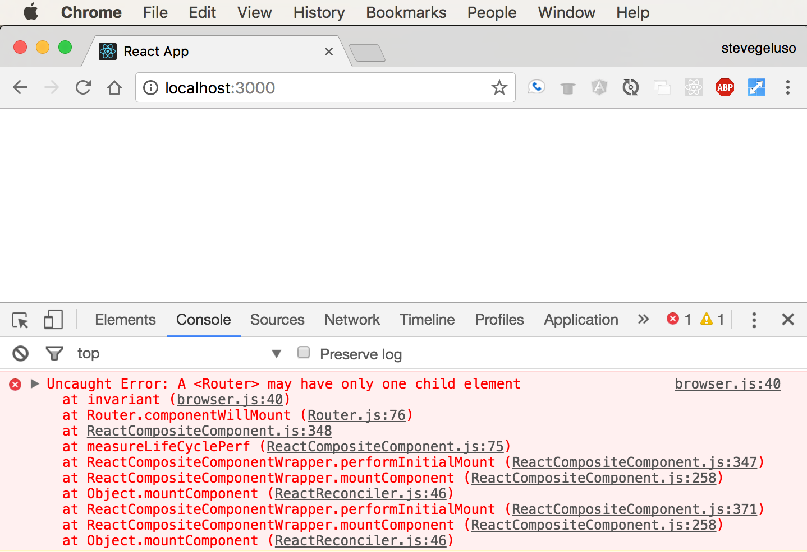

#  React Router

### Learning Objectives

*After this code-along section, you will be able to:*
* Describe React Router's main features: routing, components, history
* Use React Router to map URLs to components
* Use React Router to create links to different pages

## React Router

It's great that HTML5 introduced new browser history mechanics to make it easier
for us as developers to build Single Page Applications, and it's important to know what's going on under the hood.

However, on an important note - we're actually not going to be using these new features directly ourselves!

Instead, we'll use a tool called **React Router**, which bundles everything together so we don't have to worry about it.

For an intro to React Router, watch [this video](https://generalassembly.wistia.com/medias/tep72w77ir)

**React Router** is a third party library that makes it easy for us to route URLs - not to different pages, but by dynamically loading different components on the same page as the user navigates to different URLs. Once we define how the URLs are routed to the components, **React Router** will manage our Single Page App's browser history automatically.

Here's what React Router provides:

* **Routing:** easily define what content is associated with what URLs.
* **History:** automatically manage browser history when the user navigates between content.

React Router is actually a **third-party** library. "Third-party" just means it's not built by React and not built by ourselves; it was written by some other "third-party" group of developers. Even though React Router is third-party software, it's extremely useful, trustworthy, and popular - don't be afraid to use it. With more than 20,000 stars on Github, it’s safe to assume React Router is here to stay.

So let's use it!

## The Plan: Our Example Dentist Website

We're going to make an example dentist website that has:
- A `Home` page.
- A page that lists available `Procedures`.
- A page displaying `Contact` information.

Each of these pages of content will be built into their own regular React component; then we'll create a unique URL route that leads to each component.

Here's how we'll route our single-page application:

| **URL Route**  | **Component**  | **Content Description**                          |
|----------------|----------------|--------------------------------------------------|
| /              | `<Home>`       | A homepage with welcome text.                    |
| /procedures    | `<Procedures>` | A list of all dentist procedures.                |
| /contact       | `<Contact>`    | A page with an address, phone number, and email. |

Remember, the URL routes are paths off our main website. We could put our website at any domain, like `www.ourdentistwebsite.com` or `www.premiumdental.com`, and the URL route paths would behave the same. Paths only care about what comes after the domain name.

Our routes say that if someone goes to `ourdomain.com/` they will see our home page with welcome text.
- The content of this page will all be defined in its own `Home` component in a file called `home.js`.
- If someone navigates to the URL `ourdomain.com/contact`, they will see content with the business address, a phone number, and an email. All of this content will be defined in a component called `Contact` in a file called `contact.js`.

In the below codealong, we will walk through building this out together.

You can see a live working copy of the site [here](https://react-router-dentist.herokuapp.com/).

You are going to follow along, so that you have a locally working React Router application! However, if you'd like at any point to refer to the finished code, you can see all of the final code [here](../../../react-router-simple-dentist-site).

## In Your Terminal

> Remember to stop any React project you currently have running!

Now let's make the dentist project. In your terminal, use `create-react-app` to make a new project called `dentist-website`:

```
$ create-react-app dentist-website
$ cd dentist-website
$ npm start
```

Your browser should open to <http://localhost:3000/> and you'll see the standard "Welcome to React" message with a fancy rotating atomic icon. `create-react-app` creates several files for us in a directory called `src`. Open the `App.js`
file in your editor.

Remember, `App.js` contains our main application (it's what's called by `index.js`). You should see the basic JSX structure of the standard React starter page. Make sure the file is the same thing you're looking at in the browser by finding the text `Welcome to React` inside an `<h2>` element.

Change the text to say `Hello!`, save the file and make sure you see the changes automatically appear in your browser.

> If it doesn't automatically refresh, then try to manually refresh the page. If you still don't see changes after a manual refresh then  something could be wrong. Make sure you're editing the right file.

**Pro tip:** It's a good idea to make simple, verifiable changes like this when you're first starting a project. It's a good sanity check.

Make sure you can do simple things first. Don't start with complex things; complex changes come with greater potential for error. Prove to yourself the small changes work, and you'll save yourself headaches debugging large complex changes.

# Installing React Router
Let's install **React Router**.

Hit `ctrl-c` to stop the running app, so that we can use the terminal!

Since React Router is a third-party library, we'll need to use to download React Router and save it as a dependency in our project.

In your terminal, enter:

```sh
$ npm install react-router-dom
```

# Create Custom Homepage

Let's start the app again. Enter the command `npm start` in your terminal.

Let's get rid of the standard "Welcome to React" page and replace it with our own dentist website home page. Continue editing `App.js`: take out most of the JSX contents, and delete the import statement for `logo.svg`, which we won't use.

The `App.js` file contains one component that our whole app will live inside of. Remember that React components have a `render(){ ... }` function that defines what the component will look like when it is rendered on the webpage.

> Reminder! The render function alway has to return *at most* one top-level element. It's common to wrap everything in your component in a `div` to make sure you satisfy this constraint.

**So...**

Let's add one `<h1>` that says `Dentist Website` and a paragraph with some short welcome text. Your `App.js` file should now look like the code below. Save the file and check your browser to make sure the changes show up.

**App.js**
```js
import React, { Component } from 'react';
import './App.css';

class App extends Component {
  render() {
    return (
      <div>
        <h1>Dentist Website</h1>
        <p>
          Welcome to my dentist website.
        </p>
      </div>
    )
  }
}

export default App
```

Great! Now we have a simple homepage set up. Let's move on to getting the rest of the content for our site set up.

# Creating Our Homepage Component

We've been editing `App.js`, which defines one component for our entire application. So far our app manually shows just the homepage. Let's refactor this so the content of the homepage is moved into its own component called `Home`.

1. Create a new file called `Home.js`.
2. Copy and paste everything inside `App.js` into `Home.js` to use as a template for how to create a React component.
3. Delete the import statement for `./App.css`.
4. Find everywhere the file says `App` and replace these instances with `Home`. This code previously created a component called `App`. Now we're rewriting it to create a component called `Home`.
5. Nothing needs to change in the rest of the `Home` component. You can look at the `render() { ... }` function and verify that it's returning content that represents our home page.  It should just be the one top-level `<div>`, the `<h1>` and a `<p>` paragraph element (if you used the same content as we did). Great. Now you have your `Home` component.
6. Go back to the `App.js` file and delete the `<h1>` and `<p>` tags where we used to have content written directly inside our `App` component. We don't need that written inside `App` any longer, because we just moved it all to the new `Home` component.
7. Instead, we need to call our new component. Put `<Home />` inside the `<div>` in the `App` component. This tells the `App` component to render the `Home` component right there inside the div.
8. Don't forget to import it at the top of `App.js`.

Your `App.js` and `Home.js` files should look like this after you've properly created and imported the `Home` component.

**App.js**
```js
import React, { Component } from 'react';
import './App.css';
import Home from './Home';

class App extends Component {
  render() {
    return (
      <div>
        <Home></Home>
      </div>
    )
  }
}
export default App
```

**Home.js**
```js
import React, { Component } from 'react';

class Home extends Component {
  render() {
    return (
      <div>
        <h1>Dentist Website</h1>
        <p>
          Welcome to my dentist website.
        </p>
      </div>
    )
  }
}

export default Home
```

# Create Components for Procedures and Contact
The purpose of our site is to create several components that we can swap out as the main content of the main page of our application in order to create a modern Single Page Application. We'll create two more components, and then we'll start routing things up.

1. Create a new file called `Procedures.js`
2. Create a new file called `Contact.js`

To create these new files, follow the same procedure we used to create the `Home` component. Basically, we used the `App` component as a template: create each file, change the name of the component to its new name, then replace the JSX in the `render() { ... }` function with custom content. Be sure to import each new component into `App.js` just like we did with the `Home` component.

You can put your own content to be rendered by each component if you'd like.

Now that we have our components made, there's nothing stopping us from importing multiple components into our App.js. So now, we have:

**App.js**
```js
import React, { Component } from 'react';
import './App.css';

import Home from './Home';
import Procedures from './Procedures';
import Contact from './Contact';

class App extends Component {
  render() {
    return (
      <div>
        <Home></Home>
        <Procedures></Procedures>
        <Contact></Contact>
      </div>
    )
  }
}

export default App
```

> Check yourself! You should see all of content for each of the pages all stacked on top of each other on the homepage. If you don't see content from all three of your components, something is wrong. You must fix this before continuing. Always do simple things before doing complex things!

# Displaying Pages Individually

Try manually deleting two of the three components so only one component is left on the page at a time. You should see your webpage update with just that component. This is effectively what **React Router** does. We can configure React Router so that it's aware of which component we want to show on the screen, and React Router will swap the components out so that only the correct one is shown at a time.

Now that we've proven to ourselves that we're able to show each of the components on the main page, it's time to hook them up to Router.

## Creating Routes
Here's the general syntax for creating routes. React Router uses some of its own components to define how URLs are routed to your components and to create links to those routes. You must have one `<Router>` component that wraps itself around multiple `<Route>` components. Each `<Route>` component has two pieces:
- `path` - defining the URL path that leads to the component.
- `component` - defining what component users will see when they navigate to the path.

Delete what is currently returned in the `render` function of your `App.js`, and replace it with a Router component call with three routes, as shown below.

```js
class App extends Component {
  render() {
    return (
      <Router>
        <div>
          <Route exact path="/" component={Home} />
          <Route path="/procedures" component={Procedures} />
          <Route path="/contact" component={Contact} />
        </div>
      </Router>
    )
  }
}
```

There are three other important things to note here:

- This goes *in place of* your existing component calls of `<Home />` (depending on which syntax you went for).

- The first route for the homepage at the root URL path `/` uses a special extra `exact` attribute before defining the path. The `exact` attribute means the component associated with the route will only be shown if users are at exactly that URL path. If you forget to include the `exact` keyword, when someone navigates to `/contact` they will actually see two components, because `/` is a partial match for `/contact`.

- Notice that all of the `<Route>` components are wrapped inside one `<div>`. Like `render`, the `<Router>` element can only have one direct child element. If you don't wrap the routes with a `<div>`, the page will appear blank, and you'll have to open your JavaScript console to see that there's an error being logged to the console. Like so -



**Pro tip:** It's a good habit to check the console for errors whenever your app is not behaving as expected.

## Import Statements
In order to use the React Router components in `App.js`, you'll need to import them. This import syntax allows us to grab several specific components out of the `react-router-dom` library at once. So far we've used `Router` and `Route`.

The Router component is actually called `BrowserRouter` inside the library package, but we'll use the `as` keyword to rename it to
`Router` so it's easier to remember.

While we're here, we'll also import a third component, `Link`, which we'll get to in a minute.

Put this code at the top of your `App.js`

```js
import {
  BrowserRouter as Router,
  Route,
  Link
} from 'react-router-dom';
```

## Fully Routed
Here's how the imports and all the components look like together for our dentist website:

**App.js**
```js
import React, { Component } from 'react';
import './App.css';

import {
  BrowserRouter as Router,
  Route,
  Link
} from 'react-router-dom';

import Home from './Home';
import Procedures from './Procedures';
import Contact from './Contact';

class App extends Component {
  render() {
    return (
      <Router>
        <div>
          <Route exact path="/" component={Home} />
          <Route path="/procedures" component={Procedures} />
          <Route path="/contact" component={Contact} />
        </div>
      </Router>
    )
  }
}

export default App
```

# Navigate to the Routes
Now that everything is hooked up you can manually enter different URLs and see how your page appears. If you go to <http://localhost:3000/>, you should see just the homepage. If you go to <http://localhost:3000/procedures>, you should see just the procedures page. If you go to <http://localhost:3000/contact>, then you should see just the contact page.

> Check it!
> * Make sure that React Router is routing from each URL to the proper component
correctly.
> * Double check to make sure that the home page doesn't display at the same time as another component. If the homepage is shown while you're at the path to `/procedures` or `/contact` then you probably did not write the `exact` keyword when you defined the `/` Home route.

## Debugging Common Errors
Let's intentionally make an error. Delete the `exact` keyword off the Home route. Navigate to the `/procedures` page and the `/contact` page again and see how the components are displayed. You should see the content of the homepage and the content for one of the other pages at the same time, with the home page on top.

Now add the `exact` keyword back to the home route and notice that the pages don't double up any more.

Two common errors:
1. If the page appears blank, open the JavaScript console to see if there are errors. Chances are you have a typo somewhere or forgot to make sure the `<Router>` only has one child element. Remember, wrap all of your `<Route>` components in one `<div>`.
2. If multiple components appear on the page at the same time there's something with how you've routed URLs. Make sure you use the `exact` keyword on the root path `/` and make sure there are no duplicate URL paths defined anywhere.

# Adding a Nav Section
Great, now our site is up and running! We can manually type in URLs and see the different pages.

Although... users never really type URLs, do they? We should probably have links at the top of the page so we can just click on things. We could build this ourselves, but we don't have to! Remember that `Link` component we imported from React Router?

Just like links in HTML, we can wrap `<Link>` tags around whatever text that we want to display to the user to click on. The pieces of this are:

* `<Link>` - creates `<a>` tags and automatically integrates modern HTML5 browser history mechanics for the Single Page Application. It has one attribute:
* `to` - what path to navigate to when the user clicks the link

We'll add one `<Link>` component that leads to each of our different content pages.

```html
<Link to="/">Go to Home Page</Link>
<Link to="/procedures">See Our Procedures</Link>
<Link to="/contact">Contact Us!</Link>
```

> Did you notice that we don't reference components here? We simply make links for users to click that connect to URLs, and the `Router` section in the code handles the actual component changes.

We can include those links in a `<nav>` element at the top of our page. It will stay on the page permanently, and the different components will be swapped between each other below it. There's actually nothing special about the `<nav>` element. It behaves exactly like a `<div>`. `<nav>` Is just a semantic element that gives your JSX more meaning when people read it.

In your `App.js`, inside the `<div>` (because we want it rendered!) and before the `Route` statements, put:

```html
<nav>
  <Link to="/">Home</Link>
  <Link to="/procedures">Procedures</Link>
  <Link to="/contact">Contact</Link>
</nav>
```

So, our web app now looks like the left image - but do you see a difference between the left and the right?


There's one slightly annoying thing about React here - React strips out whitespace (e.g., spaces, returns, tabs) between elements. If we write `<Link>` components next to each other, even if they're on new lines in our code, React strips all of the whitespace between them and squishes them all together.

We must insert a space manually by writing `{' '}` in order to get spaces between our links.

So instead of the code we used before, here is how we'll format the links. Nothing has changed except that we've added the space:

```html
<Link to="/">Go to Home Page</Link>{' '}
<Link to="/procedures">See Our Procedures</Link>{' '}
<Link to="/contact">Contact Us!</Link>
```

And now the nav bar will have spaces like it should.  Try it!

# Final Code
Here's what our final `App.js` looks like:

```js
class App extends Component {
  render() {
    return (
      <Router>
        <div>
          <nav>
            <Link to="/">Go to Home Page</Link>{' '}
            <Link to="/procedures">See Our Procedures</Link>{' '}
            <Link to="/contact">Contact Us!</Link>
          </nav>
          <Route exact path="/" component={Home} />
          <Route path="/procedures" component={Procedures} />
          <Route path="/contact" component={Contact} />
        </div>
      </Router>
    )
  }
}

export default App
```

> Check it out! Does yours work?

## Rendering Components with Props

This is very cool but it lacks some very important functionality. We only know how to render a default component but we know that we frequently want to give our components props. How do we do that with React Router?

It's actually very easy. Inside of our `<Route>`s we've been using the `component` attribute. If we want more custom control, we can use a function instead but we must change the attribute from `component` to `render`. First, let's simulate some data by adding a simple array into our App's render method:

```js
render() {
  var procedures = [
    "Deep Cleaning",
    "Filling",
    "Crown",
    "Root Canal",
    "Oral Surgery"
  ]
  ...
}
```

We would normally want to pass this data into our Procedures component as props but there is no way to do that with the `component` attribute. Let's change it to `render`:

```js
...
<Route exact path="/" component={Home} />
<Route path="/procedures" render={() => <Procedures procedures={procedures} />} />
<Route path="/contact" component={Contact} />
...
```

By using `render` we can pass in a function that will render a component. We can pass in our procedures now as props. We must use `render` and pass in a function in order to render a component with props.

Let's update out Procedures component to render this new data. Go into the Procedures component and add the mapping to render this array into the page nicely.

## Route Parameters in React Router

The last thing we need to know how to do in router is pass parameters via our routes. Recall that we were able to do this in Express by including a colon in the route path followed by a variable name:

```js
app.get("/widgets/:id", ...)
```

This allows a variable value to be passed in as part of the URL. When this value landed in our route, we were able to access it via `req.params`.

React Router has very similar functionality. When we are defining the paths in our `<Route>` components, we can specify a route parameter by including the same colon followed by a variable name:

```js
<Route path='/widgets/:id' ...
```

Now, we can put variable values onto the end of our Link URLs when linking to this Route. But where do they show up? There is a special set of props that are passed into our component from the Route component but we have to add a little code to make them show up. First, the router must be using the `render` method and not the `component` method. This is because we must pass in props. Set your parameterized route up like so:

```js
<Route path='/widgets/:id' render={(props) => <WidgetShow {...props} />} />
// Router provides the props here   ^^^^^ and we pass them in ^^^^^ here to our component.
```

That syntax `{...props}` is unpacking all of the props in the props object so that they are passed into our component as individual props. The one we are interested in is called `match`. We can find it in our component in `this.props` for class-based components or just `props` for function-based components. Here is how we might access it in our component:

```js
import React from 'react';

const WidgetShow = (props) => {
  return (
    <div>
      <h1>You entered this URL parameter: {props.match.params.id}</h1>
    </div>
  )
}

export default WidgetShow;
```

Because the route parameter is passed in via props, we can easily reference it to find the item associated with the parameter. Frequently, we use this to display the details of one specific item in a collection, like in our READ ONE routes.
