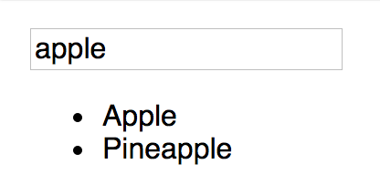

# Lifting State

##  Unidirectional Data Flow

#### Learning Objectives

_After this lesson, you will be able to:_

* Define unidirectional flow
* Diagram data in a component hierarchy

### What is Unidirectional Data Flow?

Let's start with [a video explaining this concept](https://generalassembly.wistia.com/medias/v2uenqkgwk).

In React applications, data usually flows from the top down. Why do we care? How does this apply?

When several components in a view need to share `state`, you lift, or **hoist**, the `state` so that it's available to all the components that need it. Define the state in the highest component you can, so that you can pass it to any components which will need it. Let's look at a search filter as an example. This app will have two basic components - one that displays a list of data, and one that captures user input to filter the data.

### We do: Build a fruit filter

Our data will be simple - a list of fruits. The app will end up looking something like this:



When building a React app, it's important to take time to define the app's structure before you start writing code. I'm going to define the **components** and the **state** I need before I write the code.

#### Components

This app needs two components: 
- A `List` component to display the list of fruit. 
    - This component needs one piece of data: the array of fruits to display.
- An `Input` to capture the filter value from the user.
    - This component needs one piece of data: the current value of the filter.

#### State

This app needs to keep track of changes in two items: 
* The filtered list of fruits 
* The value of the filter

#### Component hierarchy

I have two sibling components \(components at the same level of the tree/app\) that need to be aware of each other's data. Specifically, the `List` component needs to only show the fruits that match the filter value. So I need to get data from one sibling to another. Something like this:


How to achieve this, though? Using unidrectional data flow, of course! If I create a container component to hold both the filter value and the filtered list, I can hoist the `state` to the container so it's available to all the children. It will then be simple to display the `state` in the child components. The data will flow like this:


Now that I know the components I need, the `state` I need, and where everything needs to be, I can start writing some code.

## Child Components

```javascript
import React from 'react';

class List extends Component {
    render(){
        return (
            <ul>
                {/* list will go here */}
            </ul>
        )
    }
}

export default List;
```

```jsx
import React from 'react';

class Input extends Component {
    render(){
        return (
            <div>
                <label htmlFor="fruit-filter">Filter these Fruits: </label>
                <input type="text" name="fruit-filter" />
            </div>
        )
    }
}

export default Input;
```

#### Container component

My container will be a class with a few methods I'll use to initialize and update the state of the two child components. In the constructor, I'll initialize the state:

```jsx
    state = {
      // initialize the fruit list to the full list passed in props
      fruitsToDisplay: this.props.fruits,
      // intialize the filter value to an empty string
      filterValue: ''
    }
```

I'll need a method to update the `state` when the filter value changes. This method will store the filter `state`, and filter the list of fruits to display. I'll pass this change handler to the filter component to react to user input.

```jsx
    handleFilterChange = (e) => {
      e.preventDefault()
      const filterValue = e.target.value;
      // remove fruits that don't contain the filter value
      const filteredFruitList = this.props.fruits.filter(fruit => {
        return fruit.toLowerCase().includes(filterValue.toLowerCase())
      })
      this.setState({
          fruitsToDisplay: filteredFruitList,
          filterValue,
      })
    }
```

Finally, I need to render my child components.

```jsx
render() {
    return (
        <div>
          <Input value={this.state.filterValue} onChange={this.handleFilterChange} />
          <List fruits={this.state.fruitsToDisplay} />
        </div>
    )
  }
```

The full container component looks like this:

```javascript
import React, {Component} from 'react';
import Input from './Input'
import List from './List'

class FruitContainer extends Component {
    state = {
      // initialize the fruit list to the full list passed in props
      fruitsToDisplay: this.props.fruits,
      // intialize the filter value to an empty string
      filterValue: ''
    }
  
    handleFilterChange = (e) => {
      e.preventDefault()
      const filterValue = e.target.value;
      // remove fruits that don't contain the filter value
      const filteredFruitList = this.props.fruits.filter(fruit => {
        return fruit.toLowerCase().includes(filterValue.toLowerCase())
      })
      this.setState({
          fruitsToDisplay: filteredFruitList,
          filterValue,
      })
    }
  
    render() {
      return (
        <div>
          <Input value={this.state.filterValue} onChange={this.handleFilterChange} />
          <List fruits={this.state.fruitsToDisplay} />
        </div>
      )
    }
  
  }


export default FruitContainer
```
All of the data is hoisted to the top of the tree in the container, and I pass it to the child components.

Now I need to return to the children components and add the functionality to handle the data it's receiving!

## Finished Children components:

```jsx
import React, {Component} from 'react';

class Input extends Component {
    render(){
        return (
            <div>
                <label htmlFor="fruit-filter">Filter these Fruits: </label>
                <input type="text" value={this.props.value} onChange={this.props.onChange} name="fruit-filter" />
            </div>
        )
    }
}

export default Input;

```

```jsx
import React, {Component} from 'react';

class List extends Component {
    render(){
        const fruitItems = this.props.fruits.map((f)=>{
            return <li>{f}</li>
        })
        return (
            <ul>
                {fruitItems}
            </ul>
        )
    }
}

export default List;

```

## You do: Also display the fruits that do _not_ match the filter

* Add another child component to the

  `FruitContainer` that displays the fruits that do _not_ match the filter value

  \(this should be all the items that are not in the `fruitsToDisplay` list\).

_Hint: Will you need to have a new state?_

### Solution - Unmatching Filter

Coming Soon!

### Final Thoughts

It's important that you think through your applications before you start writing code. It's often helpful to sketch out your app, and identify:

* the **components**

  you will need

* the **states** you will need
* where those states need to live

Use the unidirectional data flow pattern - hoist your state toward the top of the component tree so it's available to the children that need it.

